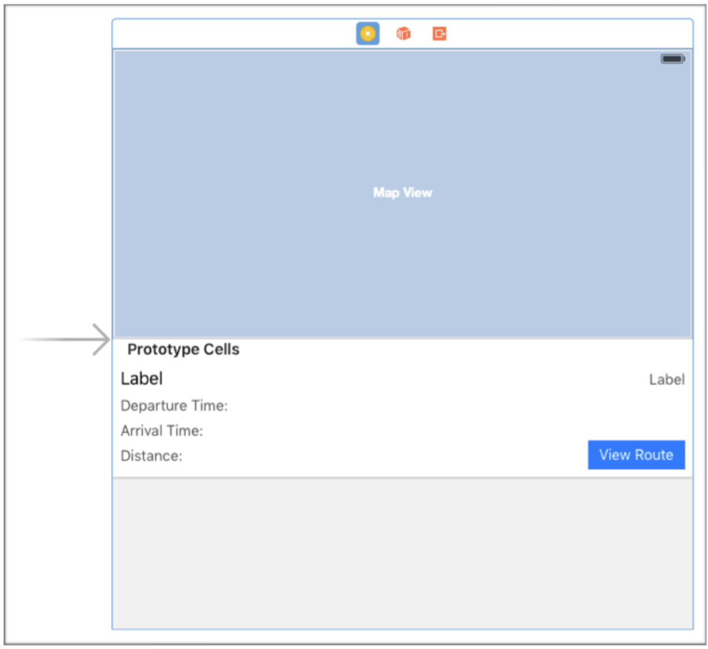
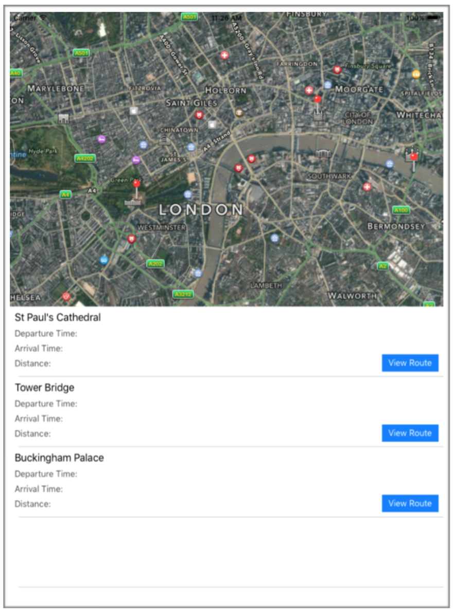

# Day 10 :: MapKit Transit ETA Requests

MapKit은 업데이트 될 때마다 개발자들에 점점 더 많은 기능을 선보여왔고, iOS 9 또한 마찬가지이다. 이번 장에서는 새 MapKit API들 일부를 살펴보면서 새로 나온 도착 예상시간 기능을 적용한 앱을 만들어보자.

## 주목할만한 새 API

### MapKit View 개선

이제 맵에서 나타나는 콜아웃 뷰 레이아웃을 더욱 다채롭게 짤 수 있다. MKAnnotation은 이제 아래 프로퍼티들을 커스터마이징할 수 있다.

- 제목
- 보조 설명
- 오른쪽 Accessory View
- 왼쪽 Accessory View
- Detail Callout Accessory View

Detail Callout Accessory View는 iOS 9에 새로 등장했다. 기존의 콜아웃 뷰에 사용할 detail accessory view를 지정할 수 있게 되었다. 이 뷰는 오토레이아웃과 제약조건을 지원하고, 기존의 콜아웃을 커스터마이징하기에 아주 좋은 방법이다.
또한, 꽤 명확한 이름의 새로운 프로퍼티들이 MKMapView에 추가되었다.

- showsTraffic (교통량 보이기)
- showsScale (축척 보이기)   
- showsCompass (나침반 보이기)

### 경로 요청 개선

애플은 iOS 9에서 MKDirectionsTransitType이라는 새로운 MKDirectionsTrasportType을 하나 추가했다. 현재로써는 ETA request(도착 예상시간 요청)에만 사용할 수 있고, 전체 경로 찾기에는 사용할 수 없다. MKDirections에 있는 `calculateETAWithCompletionHandler` 함수로 도착 예상 시간을 요청하면 MKETARequest 객체를 전달받는다. 이 객체는 예상 소요시간, 거리, 도착 예정 일자, 예상 출발 시각 등의 정보를 가지고 있다.

## 샘플 앱 만들기

새 API들이 어떻게 활용될 수 있는지 파악하고 새로 나온 도착 예상시간 요청을 써보기 위해 다음과 같은 앱을 만들 것이다. 이 앱은 사용자가 찍은 위치로부터 런던의 다양한 랜드마크들까지의 경로를 보여준다.


첫 번째 할일은 스토리보드에서 MKMapView가 화면의 절반을 채우고, UITableView가 나머지 절반을 채우도록 오토레이아웃을 설정하는 일이다.

다 되면, 프로토타입 테이블 뷰 셀을 추가하여 필요한 요소들을 추가해준다. UI를 설정하는 방법까지는 이 장에서 자세하게 다루지 않겠다. 해당 UIViewController가 해당 테이블뷰의 UITableViewDataSource와 맵뷰의 MKMapViewDelegate가 되도록 하는 것을 잊지 마라. UI를 다 설정하고 나면 스토리보드에 아래와 같은 화면이 완성되어 있을 것이다.



또한 커스텀 테이블 뷰 셀 클래스를 만들어야 할 것이다. 지금으로써는 셀 안에 있는 레이블(label)을 가지고 있는 간단한 클래스일 것이다.

```swift
class DestinationTableViewCell: UITableViewCell {
  @IBOutlet weak var nameLabel: UILabel!
  @IBOutlet weak var etaLabel: UILabel!
  @IBOutlet weak var departureTimeLabel: UILabel!
  @IBOutlet weak var arrivalTimeLabel: UILabel!
  @IBOutlet weak var distanceLabel: UILabel!
}
```

이제 스토리보드 설정이 끝났으면 지도에 핀을 추가할 차례다. 그러기 위해서는 도착지가 필요하다. Destination 클래스를 만들어서 장소들에 대한 정보를 저장하자.

```swift
class Destination {
  let coordinate:CLLocationCoordinate2D
  private var addressDictionary:[String : AnyObject]
  let name:String

  init(withName placeName: String, latitude: CLLocationDegrees, longitude: CLLocationDegrees, address:[String:AnyObject]) {
    name = placeName
    coordinate = CLLocationCoordinate2D(latitude: latitude,
    longitude: longitude)
    addressDictionary = address
    }
}
```

그러면 아래와 같이 간단하게 위치들을 만들 수 있다.

```swift
let stPauls = Destination(
  withName: "St Paul's Cathedral",
  latitude: 51.5138244,
  longitude: -0.0983483,
  address: [
    CNPostalAddressStreetKey:"St. Paul's Churchyard",
    CNPostalAddressCityKey:"London",
    CNPostalAddressPostalCodeKey:"EC4M 8AD",
    CNPostalAddressCountryKey:"England"])
```

이런 객체들을 여러 개 만들어서 배열에 저장해 둔 후 뷰가 로드되면 화면에 보여주자.

`ViewController`의 viewDidLoad 메소드 안에 아래의 코드를 넣어서 우리가 만든 장소들을 지도에 표시하도록 하자.

```swift
for destination in destinations {
  let annotation = MKPointAnnotation()
  annotation.coordinate = destination.coordinate
  mapView.addAnnotation(annotation)
}
```

이 코드가 위치들을 지도에 표시해 줄 것이다. 또한 viewDidLoad() 안에서 최초 지도의 영역을 설정해줘야 지도가 올바른 위치에서 시작된다.

```swift
mapView.region = MKCoordinateRegion(
  center: CLLocationCoordinate2D(
    latitude: CLLocationDegrees(51.5074157),
    longitude: CLLocationDegrees(-0.1201011)),
  span: MKCoordinateSpan(
    latitudeDelta: CLLocationDegrees(0.025),
    longitudeDelta: CLLocationDegrees(0.025)))
```

다음으로, 도착지들을 테이블뷰에 나타내자.

```swift
func tableView(tableView: UITableView, numberOfRowsInSection section: Int) -> Int {
  return destinations.count
}

func tableView(tableView: UITableView, cellForRowAtIndexPath indexPath: NSIndexPath) -> UITableViewCell {
  let cell = tableView.dequeueReusableCellWithIdentifier("destinationCell") as! DestinationTableViewCell
  cell.destination = destinations[indexPath.row]
  return cell
}
```

앱을 실행시키면 지도에 위치들이 표시되고 테이블뷰에 위치들의 이름이 나타나야 한다.



훌륭하지만 아직 출발점이 없으므로 도착지까지의 경로를 계산할 수 없다! 유저의 실시간 위치 정보를 사용할 수도 있지만, 이상적으로 우린 현실적인 거리상의 경로를 계산하고 싶다. 그래서 그 대신 유저가 지도에 탭하는 위치를 출발 지점으로 사용할 수 있다.

하기 위해서는 맵 뷰에 tap gesture recognizer를 추가해야 한다.

```swift
let tap = UITapGestureRecognizer(target: self, action: "handleTap:")
mapView.addGestureRecognizer(tap)
```

그러고 나서 탭을 맵뷰 상의 좌표로 변환하는 handleTap 함수를 구현하면 된다.

```swift
let point = gestureRecognizer.locationInView(mapView)
userCoordinate = mapView.convertPoint(point,
toCoordinateFromView:mapView)
```

좌표값을 구하면 나중에 사용하기 위해 저장해두고 지정한 위치를 표시할 annotation(핀)을 추가한다. 혹시 이미 annotation이 있다면 기존의 것은 제거해준다.

```swift
if userAnnotation != nil {
  mapView.removeAnnotation(userAnnotation!)
}
userAnnotation = MKPointAnnotation()
userAnnotation!.coordinate = userCoordinate!
mapView.addAnnotation(userAnnotation!)
```

마지막으로, 테이블 뷰 셀에도 이 위치를 설정해줘야 한다. 유저의 새 위치에 따라 도착 예상 시간 정보를 업데이트해줘야 하기 때문이다. 먼저 현재 보이는 셀부터 적용해준다.

```swift
for cell in self.tableView.visibleCells as! [DestinationTableViewCell] {
  cell.userCoordinate = userCoordinate
}
```

하지만 tableView: cellForForAtIndexPath 함수도 수정해야 셀들이 혹여나 다시 그려졌을 때를 대비할 수 있다. 아래의 코드를 cell이 반환되기 전에 추가하라.

```swift
cell.userCoordinate = userCoordinate
```

테이블 뷰 셀에 유저 좌표가 찍힐 때마다 업데이트를 해야 한다. 이 것은 userCoordinate 프로퍼티의 didSet 콜백을 통해서 할 수 있다. 첫번째로 이제 의미 없어진 경로 정보가 담겨 있는 레이블에 있는 텍스트를 모두 없앤다.

```swift
var userCoordinate:CLLocationCoordinate2D? {
  didSet {
    etaLabel.text = ""
    departureTimeLabel.text = "Departure Time:"
    arrivalTimeLabel.text = "Arrival Time:"
    distanceLabel.text = "Distance:"
    guard let coordinate = userCoordinate else { return }
```

유저 좌표가 있고 시작점이 있다는 걸 알았으니, 이제 `MKDirectionsRequest` 객체를 생성해서 도착 예상시간 정보를 계산할 수 있게 되었다. 시작 지점은 좌표로부터 생성된 MKMapItem으로 정하고 도착지점은 우리가 만든 Destination 객체의 mapItem 프로퍼티로 정한다. 또한 transportType 프로퍼티를 사용해 교통 경로를 요청한다고 지정해줄 수 있다.
마지막으로, `calculateETAWithCompletionHandler` 메소드를 불러 도착 예상 시간 정보를 얻어 레이블을 업데이트해준다.

```swift
let request = MKDirectionsRequest()
request.source = MKMapItem(placemark: MKPlacemark(coordinate: coordinate, addressDictionary: nil))
request.destination = destination!.mapItem
request.transportType = .Transit
let directions = MKDirections(request: request)
directions.calculateETAWithCompletionHandler { response, error -> Void in
  if let err = error {
    self.etaLabel.text = err.userInfo["NSLocalizedFailureReason"] as? String
    return
  }

  self.etaLabel.text = "\(response!.expectedTravelTime/60) minutes travel time"
  self.departureTimeLabel.text = "Departure Time: \(response!.expectedDepartureDate)"
  self.arrivalTimeLabel.text = "Arrival Time: \(response!.expectedArrivalDate)"
  self.distanceLabel.text = "Distance: \(response!.distance) meters"
}
```

이제 앱을 실행시키면 아래와 같은 결과를 볼 수 있을 것이다.


지도를 탭할 때마다 테이블뷰의 셀들이 새로운 도착 예상 정보를 표시할 것이다.

마지막 한 가지 남은 일이 있다. 각 셀에 있는 "View Route"(경로 보기) 버튼을 커스텀 셀의 IBAction에 연결시켜주고 아래의 코드를 추가해주자.

```swift
guard let mapDestination = destination else { return }
let launchOptions = [MKLaunchOptionsDirectionsModeKey:MKLaunchOptionsDirectionsModeTransit]
mapDestination.mapItem.openInMapsWithLaunchOptions(launchOptions)
```

이 코드는 아이폰의 지도 앱을 열어 도착지와 현재 위치로부터의 이동 경로를 화면에 보여줄 것이다.

### 핀 색상 바꾸기

앱은 모든 기능을 갖췄지만, 어느 핀이 유저의 위치이고 어느 핀이 도착지점인지 구분하기가 힘들다. 핀의 생김새를 바꾸기 위해서는 `MKMapViewDelegate` 프로토콜을 구현하고 ViewController를 델리게이트로 지정해줘야 한다. 그리고나서 아래의 코드를 추가할 수 있다.

```swift
func mapView(mapView: MKMapView, viewForAnnotation annotation: MKAnnotation) -> MKAnnotationView? {
  let pin = MKPinAnnotationView(annotation: annotation, reuseIdentifier: "pin")
  pin.pinTintColor = annotation === userAnnotation ? UIColor.redColor() : UIColor.blueColor()
  return pin
}
```

`pinTintColor`는 iOS 9에서 새로 추가된 프로퍼티인데, 어노테이션(annotation)의 핀 윗 부분 색을 지정해줄 수 있다. 위의 사진에서 보다시피 `mapView:viewForAnnotation`으로 넘어온 위치가 유저가 찍은 위치(userAnnotation)이면 빨간색으로 만들었고 그 외엔 파란색으로 지정해주었다. 이러면 유저가 찍은 좌표와 도착지점들을 지도에서 구분할 수 있게 된다.

### Further Reading

이 포스트에 작성된 MapKit에 대한 정보를 더 얻고 싶다면 WWDC 세션 [What's New in MapKit](https://developer.apple.com/videos/wwdc/2015/?id=206)을 참고하기 바란다.
