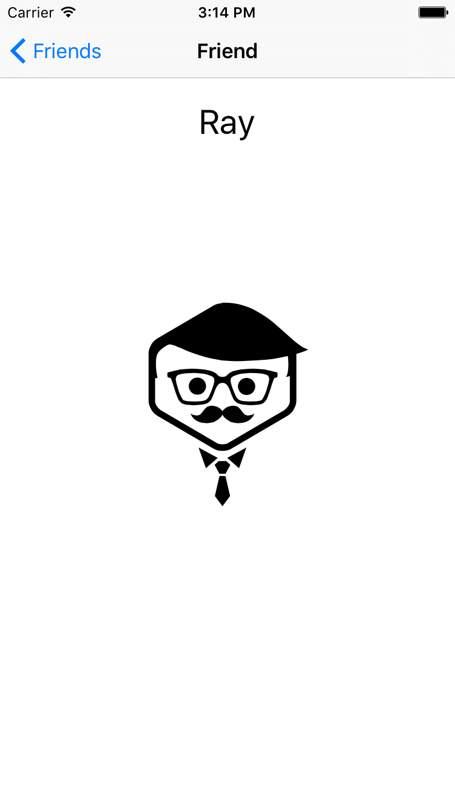
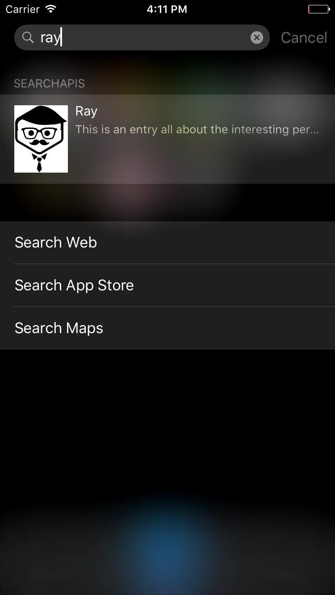
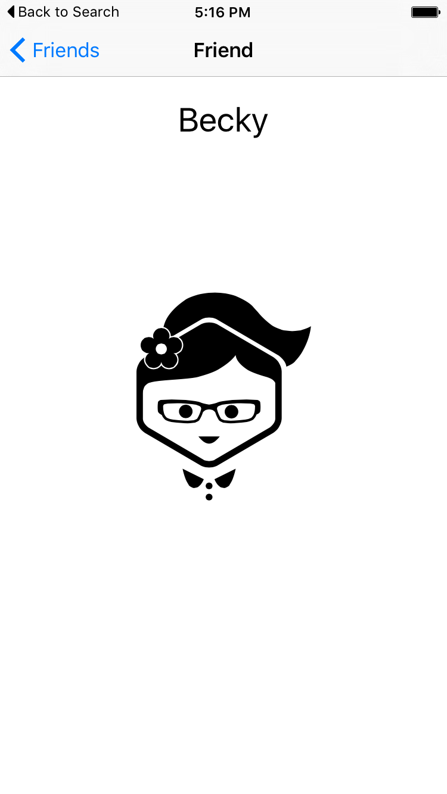

# Day 1 :: Search APIs

iOS 9 이전에는 앱의 이름으로 찾는 것으로만 스팟라이트(spotlight)를 사용할 수 있었다. 새로운 iOS 9의 Search API 발표와 함께, 애플은 개발자가 자신의 앱에서 어떤 콘텐츠가 인덱스 되기 원하고 스팟라이트에서 어떻게 가능한 잘 보여줄지, 또한 그 결과 중 하나를 선택했을 때 어떤 동작이 일어날지를 선택할 수 있게 했다.

## 3개의 API

### NSUserActivity

NSUserActivity API는 핸드오프(Handoff)를 위해 iOS 8에서 소개되었지만, iOS 9에서 액티비티의 검색이 가능하게 되었다. 당신은 이제 이런 액티비티에 메타데이터를 줄 수 있고 그것은 스팟라이트가 액티비티를 인덱스 할 수 있다는 걸 의미한다. 이것은 웹에서 브라우징 할 때의 히스토리 스택과 유사한 역할을 한다. 사용자는 스팟라이트를 통해 더 빠르게 그의 최근 액티비티를 열 수 있다.

### 웹 마크업(Web Markup)

Web Markup은 웹사이트의 콘텐츠를 스팟라이트에서 콘텐츠를 인덱스 할 수 있도록 반영한다. 사용자는 스팟라이트에서 검색 결과를 위해 그들의 디바이스에 앱(app)을 설치하지 않아도 된다. 애플의 인덱서(indexer)는 당신의 웹사이트의 특수한 마크업을 웹에서 찾아 긁어온다. 이후 사파리와 스팟라이트 모두에서 사용자에게 제공한다.

사용자의 디바이스에 앱이 설치되지 **않았을** 때도 결과가 보인다는 건 더 많은 잠재적인 사용자에게 노출될 수 있도록 해준다. 당신의 애플리케이션으로부터 Search API로 공개적으로 노출한 딥 링크(deep link)는 애플의 클라우드 인덱스에 저장된다. 웹 마크업에 대해 더 알아보기 위해 애플의 [Use Web Markup to Make App Content Searchable](https://developer.apple.com/library/prerelease/ios/releasenotes/General/WhatsNewIniOS/Articles/iOS9.html#//apple_ref/doc/uid/TP40016198-SW4) 문서를 살펴보자.

### CoreSpotlight

CoreSpotlight는 당신의 앱 안의 어떤 콘텐츠든 인덱스 할 수 있도록 해주는 새로운 iOS 9의 프레임워크이다. NSUserActivity가 사용자의 히스토리(history)를 저장하는 데는 유용하지만 이 API와 함께 당신이 원하는 어떤 데이터도 index 할 수 있다. 이 것은 근본적으로 사용자의 디바이스의 CoreSpotlight를 통해 로우 레벨(low level)의 접근을 제공한다.

## Core Spotlight API 사용하기

NSUserActivity와 웹 마크업 API는 비교적 쉬운 데 비해 CoreSpotlight는 약간 더 복잡하다. 새로운 Core Spotlight API가 어떻게 동작하는지 알아보기 위해, 우리들의 친구 목록을 보여주고 이름을 선택했을 때 사진을 보여주는 간단한 앱을 만들어 보자. Github에서 코드를 찾아 그 곳에 만들어 둔 것과 함께 따라갈 수 있다.



이 앱은 간단한 친구의 이름을 보여주는 `FriendTableViewController`와 각 친구에 대해 상세히 보여주는 `FriendViewController`를 포함하는 간단한 스토리보드를 가진다.


우리들의 친구들에 대한 모든 정보는 `Datasource` 클래스에 저장되어 있다. 우리의 친구에 대한 정보를 저장하는 모델을 만들고 또한 Core Spotlight index에 친구를 저장하기 위한 로직이 포함된 곳이다.

우선, `Datasource` 클래스에서 `Person` 객체의 목록을 만들고 저장하는 `init()` 함수를 오버라이드(override)한다. 당신은 아마도 데이터베이스나 어딘가의 서버로부터 받기를 원할 것이지만 데모 목적을 위해 단순히 몇 가지 더미 데이터를 만들 것이다.

```swift
  override init () {
    let becky = Person()
    becky.name = "Becky"
    becky.id = "1"
    becky.image = UIImage(named: "becky")!

    ...

    people = [becky, ben, jane, pete, ray, tom]
  }
```

그 데이터가 `people` 어레이(array)에 저장되면 `Datasource`를 사용할 준비가 됐다!

이제 데이터는 준비되었고 `FriendTableViewController`는 테이블 뷰의 각 셀을 표시하기 위한 요청을 할 때 사용하기 위한 `Datasource`의 인스턴스를 만들 수 있다.

```swift
  let datasource = DataSource()
```

`cellForRowAtIndexPath` 함수에서 셀의 내용을 표시하는 건 다음과 같이 간단하다:

```swift
  let person = datasource.people[indexPath.row]
  cell?.textLabel?.text = person.name
```

### Core Spotligh에 person 엔트리(entry) 저장하기

가상의 데이터가 존재하고 iOS 9에서 사용할 수 있는 새로운 API를 사용하여 Core Spotlight에 저장할 수 있다. `Datasource` 클래스로 돌아와서 `savePeopleToIndex` 함수를 정의한다. `FriendTableViewController`는 뷰가 로드 된 후에 이 함수를 호출할 수 있다.

그 함수에서 `people` 어레이(array)에서 각 person을 돌면서 각각의 `CSSearchableItem`을 만들고 `searchableItems`라는 임시 어레이에 저장한다.

```swift
  let attributeSet = CSSearchableItemAttributeSet(itemContentType: "image" as String)
  attributeSet.title = person.name
  attributeSet.contentDescription = "This is an entry all about the interesting person called \(person.name)"
  attributeSet.thumbnailData = UIImagePNGRepresentation(person.image)

  let item = CSSearchableItem(uniqueIdentifier: person.id, domainIdentifier: "com.ios9daybyday.SearchAPIs.people", attributeSet: attributeSet)
  searchableItems.append(item)
```

마지막 단계는 기본 `CSSearchableIndex`에서 `indexSearchableItems`를 호출하는 것이다. 이것은 실제로 사용자들이 검색할 수 있고 그 결과를 볼 수 있도록 CoreSpotlight에 저장하는 것이다.

```swift
  CSSearchableIdex.defaultSearchableIndex().indexSearchableItems(searchableItems, completionHandler: { error -> Void in
    if error != nil {
      print(error?.localizedDescription)
    }
  })
```

그리고 그뿐이다! 애플리케이션을 실행할 때 그 데이터는 저장될 것이다. 스팟라이트에서 검색할 때 당신의 친구가 나타날 것이다.



### 사용자에 대한 응답

지금 사용자는 스팟라이트에서 당신의 결과를 볼 수 있고 선택하길 바란다! 하지만 그랬을 때 무엇이 일어날까? 음, 결과를 누른 후 잠시 뒤 당신의 앱의 메인 스크린이 열릴 것이다. 사용자의 선택한 친구가 보이길 원한다면 조금 더 작업을 해야 한다. 앱의 `AppDelegate`에 있는 `continueUserActivity UIApplicationDelegate`를 통해 앱을 열 때의 동작을 지정할 수 있다.

이 메소드의 전체 구현은 다음과 같다:

```swift
  func application(application: UIApplication, continueUserActivity userActivity: NSUserActivity, restorationHandler: ([AnyObject]?) -> Void) -> Bool {
    // Find the ID from the user info
    let friendID = userActivity.userInfo?["kCSSearchableItemActivityIdentifier"] as ! String

    // Find the root table view controller and make it show the friend with this ID
    let navigationController = (window?.rootViewController as! UINavigationController)
    navigationController.popToRootViewControllerAnimagted(false)
    let friendTableViewController = navigationController.viewController.first as! FriendTableViewController
    friendTableViewController.showFriend(friendID)

    return true
  }
```

당신도 볼 수 있듯, `userActivity.userInfo` 딕셔너리(dictionary) 안에 있는 `indexSearchableItems` 함수로 우리가 이전에 CoreSpotlight 인덱스에 저장한 정보를 사용할 수 있다. 예제로써 관심이 있는 유일한 건 아이템의 kCSSearchableItemActivityIdentifier로 저장된 friend ID이다.

`userInfo` 딕셔너리에서 정보를 가져온 후 애플리케이션의 네비게이션 컨트롤러를 찾고 루트(root)로 팝(pop)을(사용자의 눈에 띄지 않으니 애니메이션 없이) 하고 `FriendTableViewController`의 `showFriend` 함수를 호출한다. 이것이 어떻게 동작하는지 자세히 다루지는 않지만, 이건 주어진 ID로 데이터소스(datasource)에 있는 친구를 찾은 후 새로운 뷰 컨트롤러를 네비게이션 컨트롤러 스택에 넣는 것이다. 이것이 전부다. 사용자가 스팟라이트에서 친구를 누를 때 이제 볼 수 있을 것이다:



당신도 볼 수 있듯, 이제 당신 앱의 왼쪽 위 모서리에 "검색으로 돌아기기" 옵션이 있다. 이것은 사용자가 바로 그들의 친구의 이름을 처음 선택한 검색화면으로 돌아갈 수 있도록 한다. 그들은 여전히 표준 백 버튼(back button)을 이용해서 앱을 돌아다닐 수도 있다.

### 데모 요약

위의 데모에서 우리는 `CoreSpotlight` 인덱스에 당신의 애플리케이션의 데이터를 통합하기가 얼마나 쉬운지, 사용자가 당신의 앱을 열려고 할 때 얼마나 강력한지, 그리고 특정 콘텐츠를 사용자가 찾는 데 얼마나 도움이 되는지를 봤다. 우리는 그러나 인덱스에서 데이터를 삭제하는 방법을 커버하지 **않았다**. 이것은 당신의 애플리케이션이 최신 상태로 사용하도록 인덱스를 유지하는 것과 함께 중요하다. CoreSpotlight로부터 오래된 엔트리를 지우는 방법에 대한 자세한 내용은 `deleteSearchableItemsWithIdentifiers`, `deleteSearchableItemsWithDomainIdentifiers`와 `deleteAllSearchableItemsWithCompletionHander` 함수를 살펴봐라.

## 좋은 시민성의 중요성

가능한 한 스팟라이트와 사파리로 당신의 콘텐츠를 많이 얻을 수 있다는 건 좋은 생각처럼 보일 수 있지만, 당신의 콘텐츠로 서치 인덱스에 스패밍(spamming)을 하기 전에 두 번 생각해라. iOS 에코시스템에서 좋은 시민이 되기 위해서는 당신 고객의 행복을 지키는 것뿐만 아니라는 것을 애플은 또한 알 수 있다. 그들은 타당함을 지키기 위해 많이 투자하고 있다. 참여 비율을 추적하고 스팸어(spammer)는 검색 결과의 맨 아래로 이동한다.

## 더 읽을거리

새로운 Search API에 대한 추가적인 정보로 나는 WWDC session 709, [Introducing Search APIs](https://developer.apple.com/videos/wwdc/2015/?id=709)를 보는 걸 추천한다. 또한 [NSUserActivity Class Reference](https://developer.apple.com/library/prerelease/ios/documentation/Foundation/Reference/NSUserActivity_Class/) 뿐만 아니라 [CoreSpotlight에 대한 문서](https://developer.apple.com/library/prerelease/ios/releasenotes/General/WhatsNewIniOS/Articles/iOS9.html#//apple_ref/doc/uid/TP40016198-SW3)를 읽는 것도 흥미로울 수 있다. 이글에서 설명한 프로젝트들을 실행해보고 싶다면 [GitHub](https://github.com/shinobicontrols/iOS9-day-by-day/tree/master/01-Search-APIs)에 있으니 잊지 말기 바란다.
