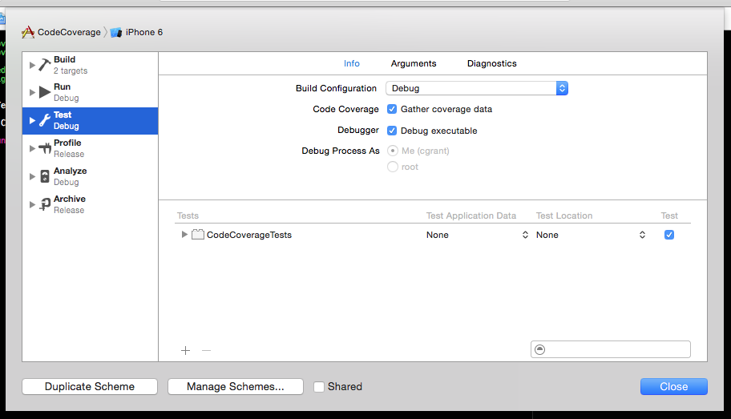

# Day 5 :: Xcode Code Coverage Tools

코드 커버리지는 단위 테스트의 가치를 측정하는 데 도움이 되는 도구이다. 높은 수준의 코드 커버리지는 테스트에 대한 신뢰를 제공하고 응용 프로그램이 더 철저하게 테스트 되었음을 나타낸다. 수천 개의 테스트를 가질 수 있지만, 많은 기능 중 하나의 테스트만 있다면, 단위 테스트 모음은 전혀 가치가 없다!

목표로 해야 하는 이상적인 코드 커버리지 비율은 없다. 이것은 프로젝트에 따라 크게 달라진다. 예를 들어, 테스트할 수 없는 시각적인 요소를 많이 가진 프로젝트면 데이터 처리 프레임워크를 만드는 경우에 비해 훨씬 낮을 것이다.

### Code Coverage in Xcode

과거에는, Xcode에서 프로젝트에 대한 코드 커버리지 보고서를 만들기 원한다면 [몇 가지](https://developer.apple.com/library/ios/qa/qa1514/_index.html) [옵션](http://www.cocoanetics.com/2013/10/xcode-coverage/)이 있었다. 그러나 꽤 복잡하고 수동 설정이 많이 필요하다. 다행히, iOS 9에서 애플은 Xcode 자체에 직접 코드 커버리지 도구를 통합했다. 도구들은 LLVM과 단단히 통합되었고 표현 식을 호출할 때마다 계산된다.

### Using the Code Coverage Tools

이제 우리는 새로운 코드 커버리지 도구를 사용하는 방법과 기존의 테스트 모음을 개선하는 방법을 위한 간단한 예제를 만들 것이다. 완성된 코드는 [Github](https://github.com/shinobicontrols/iOS9-day-by-day/tree/master/05-CodeCoverage)에서 볼 수 있고, 그래서 함께 따라 할 수 있다.

첫 번째 할 일은 새로운 프로젝트를 만드는 것이다. 단위 테스트 사용 옵션을 선택했는지 확인하라. 이것은 필요한 설정과 함께 기본 프로젝트를 생성한다. 이제 우리는 테스트할 뭔가가 필요하다. 이것은 분명히 당신이 원하는 무엇이든 될 수 있지만, 나는 빈 스위프트 파일을 추가하고 문자열이 서로의 [아나그램](https://en.wikipedia.org/wiki/Anagram) 여부를 확인하는 전역 함수를 작성했다. 이것을 전역함수로 갖는 것은 아마 최고의 디자인은 아니지만, 지금은 그렇게 할 것이다!

```swift
func checkWord(word: String, isAnagramOfWord: String) -> Bool {

  // Strip the whitespace and make both of the strings lowercase
  let noWhitespaceOriginalString = word.stringByReplacingOccurrencesOfString(" ", withString: "").lowercaseString
  let noWhitespaceComparisonString = isAnagramOfWord.stringByReplacingOccurrencesOfString(" ", withString: "").lowercaseString

  // If they have different lengths, they are difinitely not anagrams
  if noWhitespaceOriginalString.characters.count != noWhitespaceComparisonString.characters.count {
    return false
  }

  // If the strings are the same, they must be anagrams of each other!
  if noWhitespaceOriginalString == noWhitespaceComparisonString {
    return true
  }

  // If they have no content, default to true.
  if noWhitespaceOriginalString.characters.count == 0 {
    return true
  }

  var dict = [Character: Int]()

  // Go through every character in the original string.
  for index in 1...noWhitespaceOriginalString.characters.count {

    // Find the index of the character at position i, then store the character.
    let originalWordIndex = noWhitespaceOriginalString.startIndex.advancedBy(index - 1)
    let originalWordCharacter = noWhitespaceOriginalString[originalWordIndex]

    // Do the same as above for the compared word.
    let comparedWordIndex = noWhitespaceComparisonString.startIndex.advancedBy(index - 1)
    let comparedWordCharacter = noWhitespaceComparisonString[comparedWordIndex]

    // Increment the value in the dictionary for the original word character. If it doesn't exist, set it to 0 first.
    dict[originalWordCharacter] = (dict[originalWordCharacter] ?? 0) + 1

    // Do the same for the compared word character, but this time decrement instead of increment.
    dict[comparedWordCharacter] = (dict[comparedWordCharacter] ?? 0) - 1
}

  // Loop through the entire dictionary. If there's a value that isn't 0, the strings aren't anagrams.
  for key in dict.keys {
    if (dict[key] != 0) {
      return false
    }
  }

  // Everything in the dictionary must have been 0, so the strings are balanced.
  return true
}
```

이것은 비교적 간단한 기능이다, 그래서 우리는 아무 문제 없이 100%의 코드 커버리지를 얻을 수 있어야 한다.

당신의 알고리즘을 추가한 후, 그것을 테스트할 시간이다! 프로젝트를 만들 때 생성된 기본 XCTestCase를 연다. "1"이 "1"의 아나그램인지 확인하는 간단한 테스트를 추가한다. 당신의 테스트 클래스는 다음과 같이 보일 것이다.

```swift
class CodeCoverageTests: XCTestCase {

  func testEqualOnCharacterString() {
    XCTAssert(checkWord("1", isAnagramOfWord: "1"))
  }
}
```

테스트를 실행하기 전에, 우리는 코드 커버리지가 켜져 있는지 확인해야 한다! 글을 쓰는 시점에서, 이것은 기본적으로 꺼져있다, 그래서 그것을 켜도록 테스트 스키마를 편집해야 한다.



"커버리지 데이터 수집" 상자가 선택되어 있는지 확인하고, '닫기'를 누르고 테스트 타켓을 실행한다! 잘된다면 우리는 테스트를 통과할 것이다.

### The Coverage Tab

일단 테스트에 통과하면, 당신은 checkWord:isAnagramOfWord 함수가 적어도 하나의 경로에서 맞는다는 사실을 안다. 당신이 모르는 것은 테스트 되지 않은 것들이 얼마나 더 많은지다. 이것이 코드 커버리지 도구가 도움되는 곳이다. 커버리지 탭을 열면 프로그램에서 대상, 파일, 그리고 함수별로 다른 수준의 코드 커버리지를 볼 수 있다.

Xcode 왼쪽 분할 창에 있는 Report Navigator를 열고 빌드 테스트를 선택한다. 그런 다음 바에 "Coverage"를 선택한다.


이것은 클래스와 함수의 목록을 표시하고 각 테스트 범위 수준을 나타낸다. checkWord 함수에 마우스를 올리면, 당신은 우리의 테스트가 클래스의 28%를 다루는 것을 볼 수 있다. 인정할 수 없다! 우리는 이 문제를 개선하기 위해 실행하고 있는 코드 경로와 그렇지 않은 경로를 알 필요가 있다. 함수 이름을 더블 클릭하고, Xcode는 코드와 함께 코드 커버리지 통계를 열 것이다.


흰색 영역은 포함되고 실행된 코드를 나타낸다. 회색 영역은 실행되지 않은 코드를 보여준다. 이것은 우리가 확인하기 위해 더 많은 테스트를 추가해야 할 영역이다. 우측의 숫자는 코드 블록이 실행된 횟수를 나타낸다.

### Improving Coverage

분명히, 우리는 클래스의 커버리지를 28% 이상으로 목표해야 한다. UI도 없고 단위 테스트를 위한 완벽한 후보처럼 보인다. 그렇다면 좀 더 테스트를 추가하자! 이상적으로, 우리는 함수의 각 반환문에 도달할 수 있다. 이것은 우리에게 전체 범위를 제공할 것이다. 테스트 클래스에 테스트들을 추가한다.

```swift
func testDifferentLengthStrings() {
  XCTAssertFalse(checkWord("a", isAnagramOfWord: "bb"))
}

func testEmptyStrings() {
  XCTAssert(checkWord("", isAnagramOfWord: ""))
}

func testLongAnagram() {
  XCTAssert(checkWord("chris grant", isAnagramOfWord: "char string"))
}

func testLongInvalidAnagramWithEqualLengths() {
  XCTAssertFalse(checkWord("apple", isAnagramOfWord: "tests"))
}
```

이 테스트들은 완전한 코드 커버리지를 제공하기에 충분하다. 다시 단위 테스트를 실행하고 최신 테스트 보고서에서 코드 커버리지 탭으로 돌아가자.


우리는 해냈다! 코드 커버리지 100%다. 이제 전체 파일이 흰색으로 변했고 모든 코드 경로에서 적어도 한 번은 실행되었음을 나타낸다.

코드 커버리지를 사용하는 것은 실제로 코드의 모든 기능을 테스트하지 않고 많은 단위 테스트를 정말로 가치 있는 테스트 모음으로 구축하는 데 도움이 되는 좋은 방법이다. Xcode 7은 이것을 쉽게 할 수 있도록 만들고, 나는 프로젝트에 코드 커버리지를 적용하는 것을 철저하게 권장한다. 기존에 테스트 모음이 있는 경우에도, 이것은 당신의 코드가 얼마나 잘 테스트할지 좋은 아이디어를 제공하는 데 도움이 될 것이다.

### Further Reading

Xcode 7의 코드 커버리지 도구에 대한 더 자세한 내용은 WWDC 세션 410, [Continuous Integration and Code Coverage in Xcode](https://developer.apple.com/videos/wwdc/2015/?id=410)를 볼 것을 권장한다.
