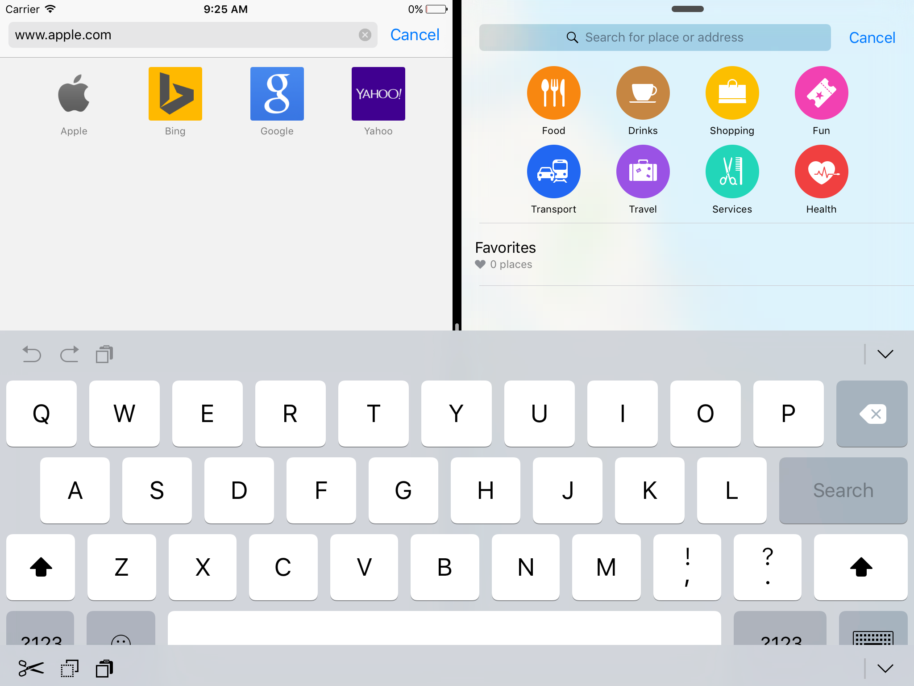

#iOS 9 Day by Day
#6. iPad Multitasking

iOS 9에서 큰 변화 중 하나는 Multitasking이다. Multitasking은 사용자가 한 화면에 하나 이상의 앱을 사용할 수 있게 한다. 두 가지 형태로 동작한다. 그 두가지는 Slide Over와 Split View이다.

##Slide Over View

화면의 오른쪽 끝에서 왼쪽으로 쓸어넘기기를 하면 앱의 목록을 보여주는 Slide over view가 나타나고 이 좁은 창에 보여질 앱을 선택할 수 있다. 이 좁은 창은 실행중인 앱 위에 나타나며, 창 왼쪽의 입력은 불가능한 상태가 된다.

##Split View

Split view를 보려면 Slide Over view에 있는 수직 구분자를 왼쪽으로 더 당겨야 한다. 두 앱 화면 사이에 있는 수직 구분자를 움직여서 앱 화면의 크기를 조정한다. Split View가 활성화 되었을 때, foreground 앱과 background 앱으로 나눠지지 않는다. 두 앱 모두 foreground 앱이다.

Split view는 현재 iPad Air 2에서만 가능하다.

##Enabling Multitasking in Your App

Xcode 7에서 생성된 새로운 프로젝트는 기본으로 Multitasking을 사용할 수 있다. 그러나 기존 응용프로그램을 가지고 있다면, 직접 활성화해야 한다. iOS 9 SDK를 사용하는 경우 이를 활성화하는 몇 단계 과정이 있다.

1. 앱의 모든 사용자 인터페이스의 모든 화면 방향을 활성화 시킨다.
2. Launch Storyboard를 사용한다.

###Opting Out
이미 위의 것들을 했다면, iOS 9 SDK로 앱을 빌드할 때 multitasking은 활성화 될 것이다. 이 기능을 빼고 싶다면, `info.plist` 파일의 `UIRequiredFullscreen` 키를 지정하라.

###The Importance of Auto Layout
Auto Layout은 iOS 6에서 처음으로 소개되었다. 그리고 고정된 위치가 아닌 제약을 지정하는 것으로 UI를 배열하는 방법을 제공한다. Auto Layout의 다음 단계로 여러 크기 클래스에 기반하여 다른 제약을 지정하는 Adaptive Layout은 iOS 8에서 소개되었다. 크기 클래스는 앱 창의 높이와 넓이에 대해서 상대적인 표시 공간의 크기를 나타낸다. 

Multitasking의 특성으로 인하여 iOS 9 SDK에서 앱을 컴파일할 때, 고려해야할 몇 가지 문제가 있다. 

###Don't Use UIInterfaceOrientation any more!
앱이 Multitasking을 지원한다면 개념적으로 UIInterfaceOrientation은 더 이상 동작하지 않는다. Mutitasking 앱을 가지고 있고 현재 UIInterfaceOrientation을 확인한다면, 앱이 전체 화면에서 동작하고 있는지 확신할 수 없다. Split View에서 앱이 실행중이고 iPad가 가로모드라면, 수평보다 수직이 더 큰 경우지만 UIInterfaceOrientationPortrait을 반환할 것이다.

때때로 앱의 창 크기에 기반해서 여전히 인터페이스를 수정할 필요가 있을것이다. 그래서 어떻게 할 수 있을까? `traitCollection.horizontalSizeClass`을 사용하는 것이 답이다. 앱에서 선택적으로 뷰를 배치할 수 있게 인터페이스에 대한 크기 클래스 정보를 준다. 

###Size Change Transition Events

Previously, events such as `willRotateToInterfaceOrientation` and `didRotateToInterfaceOrientation` were the recommended way to make changes to your application when the screen rotated. In iOS 8, Apple introduced `willTransitionToTraitCollection` and `viewWillTransitionToSize`. These methods become even more important in iOS 9 with the introduction of multitasking. To check whether your interface is portrait or landscape, which you still may wish to do, you can manually compare the width to the height.

###Responding to Keyboard Events

In the past, the only time your app would be effected by the keyboard was when it was opened by your app itself. Now, it's possible to have a keyboard appear on top of your app, even though a user did not open it from your app.

In some cases, you may be fine with the keyboard appearing on top of your app. However, if it obstructs an important piece of your UI then your users may be obstructed. In this situation, you should respond to one of the `UIKeyboard` notifications that have been around for a long time now. `WillShow`, `DidShow`, `WillHide`, `DidHide`, `WillChangeFrame` and `DidChangeFrame` notifications should give you the ability to do this. These events will fire in **both** apps that are present on screen.

###Other Considerations

The changes you will have to make aren't just visual. Previously, apps could rely on being the only app running in the foreground. You had sole access to the vast majority of system resources such as the CPU, GPU and memory. However, this has now changed. If a user has split view or slide over view active, and, at the same time, is watching a video in the new iOS 9 [picture in picture mode](https://developer.apple.com/library/prerelease/ios/documentation/WindowsViews/Conceptual/AdoptingMultitaskingOniPad/QuickStartForPictureInPicture.html), then these resources must be shared between three applications.

> *For best user experience, the system tightly manages resource usage and terminates apps that are using more than their fair share* - Apple iOS 9 Multitasking Documentation

You should therefore profile and heavily test your applications on different variations of iPad so that you are confident that your application is as efficient as it can be and is not using resources that it does not need.

##Further Reading
iOS 9의 새로운 multitasking 기능에 대한 더 많은 정보를 원한다면, iOS 개발자 라이브러리의 가이드에서 [Adopting Multitasking On iPad](https://developer.apple.com/library/prerelease/ios/documentation/WindowsViews/Conceptual/AdoptingMultitaskingOniPad/index.html) 살펴 보라. WWDC 205 세션 [Continuous Integration and Code Coverage in Xcode](https://developer.apple.com/videos/wwdc/2015/?id=410)을 보는 것을 추천한다. 이 글에서 우리가 만들고 설명했던 프로젝트를 시도하려고 한다면, [GitHub](https://github.com/shinobicontrols/iOS9-day-by-day/tree/master/05-CodeCoverage) 에서  찾을 수 있다는 것을 잊지 마시라.
