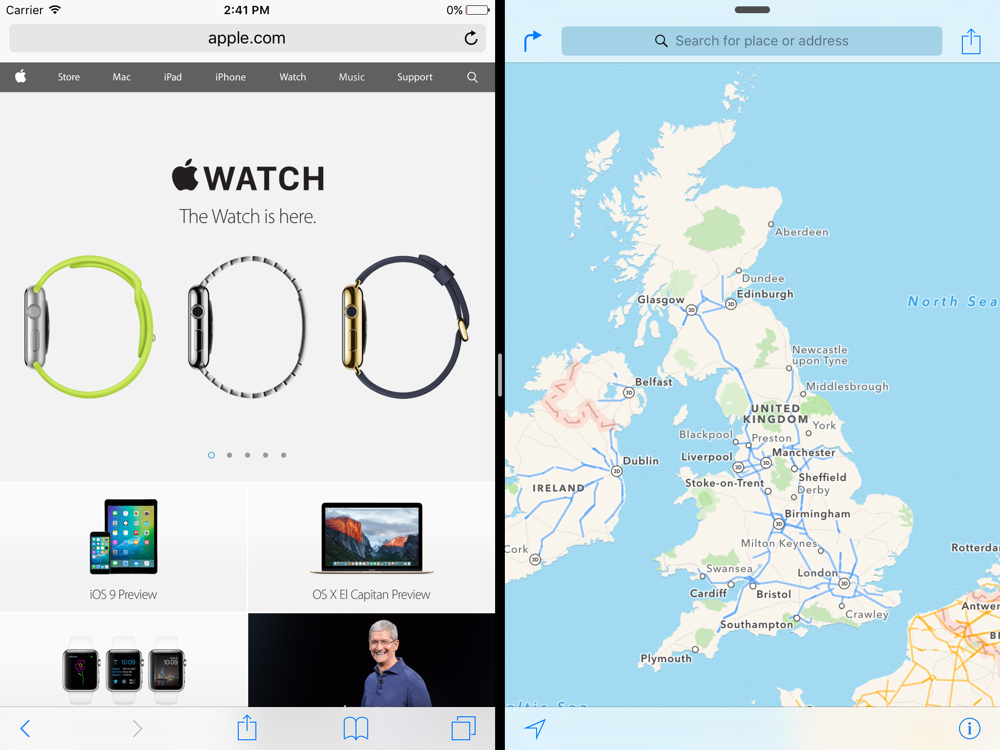

#iOS 9 Day by Day
#6. iPad Multitasking

iOS 9에서 큰 변화 중 하나는 Multitasking이다. Multitasking은 사용자가 한 화면에 하나 이상의 앱을 사용할 수 있게 한다. 두 가지 형태로 동작한다. 그 두 가지는 Slide Over와 Split View이다.

##Slide Over View

화면의 오른쪽 끝에서 왼쪽으로 쓸어넘기기를 하면 앱의 목록을 보여주는 Slide over view가 나타나고 이 좁은 창에 보일 앱을 선택할 수 있다. 이 좁은 창은 실행 중인 앱 위에 나타나며, 창 왼쪽의 입력은 불가능한 상태가 된다.

##Split View

Split view를 보려면 Slide Over view에 있는 수직 구분자를 왼쪽으로 더 당겨야 한다. 두 앱 화면 사이에 있는 수직 구분자를 움직여서 앱 화면의 크기를 조정한다. Split View가 활성화되었을 때, foreground 앱과 background 앱으로 나뉘지 않는다. 두 앱 모두 foreground 앱이다.

Split view는 현재 iPad Air 2에서만 가능하다.

##Enabling Multitasking in Your App

Xcode 7에서 생성된 새로운 프로젝트는 기본으로 Multitasking을 사용할 수 있다. 그러나 기존 응용프로그램을 가지고 있다면, 직접 활성화해야 한다. iOS 9 SDK를 사용하는 경우 이를 활성화하는 몇 단계 과정이 있다.

1. 앱의 모든 사용자 인터페이스의 모든 화면 방향을 활성화 시킨다.
2. Launch Storyboard를 사용한다.

###Opting Out
이미 위의 것들을 했다면, iOS 9 SDK로 앱을 빌드할 때 multitasking은 활성화될 것이다. 이 기능을 빼고 싶다면, `info.plist` 파일의 `UIRequiredFullscreen` 키를 지정하라.

###The Importance of Auto Layout
Auto Layout은 iOS 6에서 처음으로 소개되었다. 그리고 고정된 위치가 아닌 제약을 지정하는 것으로 UI를 배열하는 방법을 제공한다. Auto Layout의 다음 단계로 여러 크기 클래스에 기반을 두어 다른 제약을 지정하는 Adaptive Layout은 iOS 8에서 소개되었다. 크기 클래스는 앱 창의 높이와 넓이에 대해서 상대적인 표시 공간의 크기를 나타낸다. 

Multitasking의 특성으로 인하여 iOS 9 SDK에서 앱을 컴파일할 때, 고려해야 할 몇 가지 문제가 있다. 

###Don't Use UIInterfaceOrientation any more!
앱이 Multitasking을 지원한다면 개념적으로 UIInterfaceOrientation은 이제는 동작하지 않는다. Mutitasking 앱을 가지고 있고 현재 UIInterfaceOrientation을 확인한다면, 앱이 전체 화면에서 동작하고 있는지 확신할 수 없다. Split View에서 앱이 실행중이고 iPad가 가로모드라면, 수평보다 수직이 더 큰 경우지만 UIInterfaceOrientationPortrait을 반환할 것이다.

때때로 앱의 창 크기에 기반해서 여전히 인터페이스를 수정할 필요가 있을것이다. 그래서 어떻게 할 수 있을까? `traitCollection.horizontalSizeClass`을 사용하는 것이 답이다. 앱에서 선택적으로 뷰를 배치할 수 있게 인터페이스에 대한 크기 클래스 정보를 준다. 

###Size Change Transition Events

예전에는 `willRotateToInterfaceOrientation`과 `didRotateToInterfaceOrientation` 같은 이벤트들이 화면이 회전할 때 앱의 변화를 주는 추천하는 방법이었다. 애플은 iOS 8에서 `willTransitionToTraitCollection`과 `viewWillTransitionToSize`을 소개했다. Multitasking의 도입으로 이 방법들은 iOS 9에서 더욱 중요해졌다. 인터페이스가 가로 또는 세로인지 확인하기를 원한다면, 직접 넓이와 높이를 비교할 수 있다.

###Responding to Keyboard Events

과거에는 앱이 키보드에 영향을 받는 시점은 앱에서 키보드를 띄울때 뿐이였다. 사용자가 앱에서 키보드를 띄우지 않더라도, 지금은 앱 위에 키보드가 나타날 수 있다.

몇몇 경우에 앱위에 키보드가 나타나는 것은 괜찮을 수 있다. 그러나 키보드가 앱 UI의 중요한 부분을 가린다면 그때 사용자는 방해를 받을 수 있다. 이 상황에서 오래동안 머무르는 `UIKeyboard` 알림중에 하나에 응답해야 한다. `WillShow`, `DidShow`, `WillHide`, `DidHide`, `WillChangeFrame`, `DidChangeFrame` 알림이 이 작업을 가능하게 한다. 이 이벤트들은 화면에 있는 **두** 앱들에 전달된다.

###Other Considerations

만들어야 할 변화들은 눈에 보이지않다. 예전에는 앱들은 앞(foreground)에서 수행되는 하나의 앱이 되는 것에 의존했었다. CPU, GPU, 메모리 같은 다양한 시스템 자원들의 대부분을 독점했었다. 그러나, 이제는 바뀌었다. 사용자가 split view 또는 slider over view 그리고 동시에 새로운 iOS 9의 [picture in picture mode](https://developer.apple.com/library/prerelease/ios/documentation/WindowsViews/Conceptual/AdoptingMultitaskingOniPad/QuickStartForPictureInPicture.html)로 동영상을 보고 있다면, 3개의 앱들은 다양한 시스템 자원들을 공유해야만 한다.

> *최고의 사용자 경험을 위해서 시스템은 자원 사용을 엄격하게 관리하고 정당한 몫 이상 자원을 사용하는 앱을 종료시킨다.* - Apple iOS 9 Multitasking 문서

따라서 앱이 가능한 불필요한 자원을 사용하지 않을 만큼 효율적이라는 것을 확신하기 위해서 iPad의 다양한 상태에서 앱을 분석하고 많이 테스트 해야한다.

##Further Reading
iOS 9의 새로운 multitasking 기능에 대한 더 많은 정보를 원한다면, iOS 개발자 라이브러리의 가이드에서 [Adopting Multitasking On iPad](https://developer.apple.com/library/prerelease/ios/documentation/WindowsViews/Conceptual/AdoptingMultitaskingOniPad/index.html) 살펴 보라. WWDC 205 세션 [Continuous Integration and Code Coverage in Xcode](https://developer.apple.com/videos/wwdc/2015/?id=410)을 보는 것을 추천한다. 이 글에서 우리가 만들고 설명했던 프로젝트를 시도하려고 한다면, [GitHub](https://github.com/shinobicontrols/iOS9-day-by-day/tree/master/05-CodeCoverage) 에서  찾을 수 있다는 것을 잊지 마시라.
