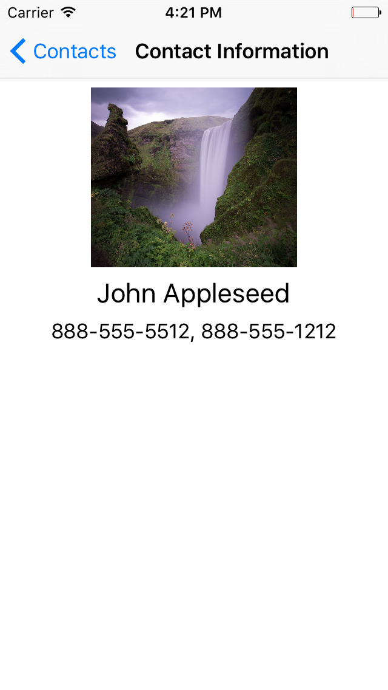
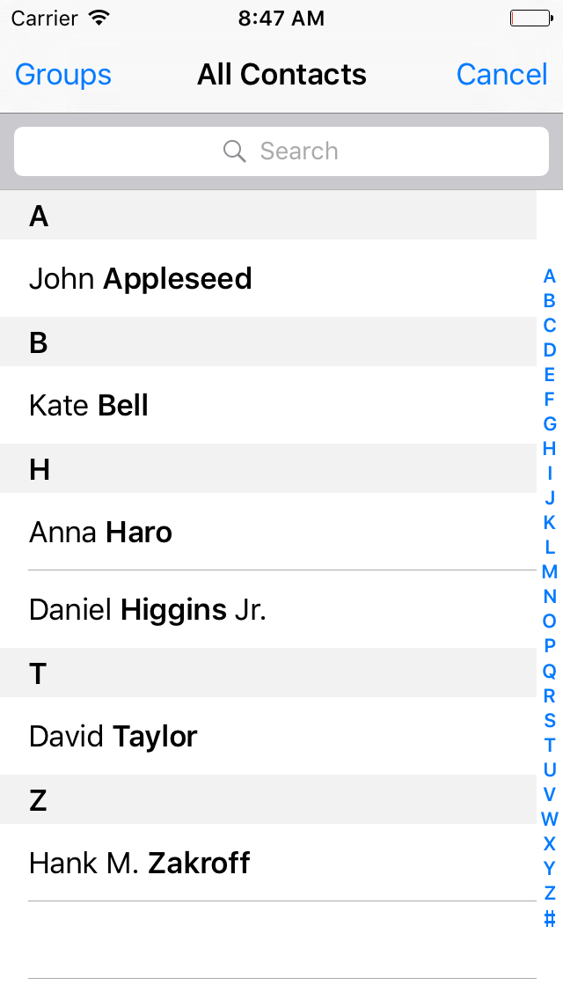

# Day 7 :: The New Contacts Framework

Apple은 iOS 9에서 새로운 연락처 프레임 워크를 도입하였다. 이것은 Swift에서도 잘 동작하고 Objective-C API를 사용하는 장치의 연락처와 상호 작용하는 방법을 제공한다! 이것은 이전의 주소록 프레임워크와 사용자의 연락처를 접근하는 메서드에 비해 큰 개선점이다. 주소록 프레임워크는 사용하기 불편했고 Objective-C API는 이를 가지고 있지 않았다. Swift에서 주소록 프레임워크를 사용하는 것은 개발자들에게 큰 고통이었다. 그리고 새로운 연락처 프레임워크가 이것을 수정할 수 있다고 기대했다.

WWDC 세션 진행 중에 iOS 9에서는 이것이 폐지된다고 발표했을때의 함성이 얼마나 많은 개발자들이 주소록 프레임워크를 싫어했는지를 나타내준다. 확실하게 지금까지 들어본 것 중 가장 길고 큰 함성이었다.

만약 당신이 서로 다른 소스에서 중복된 사본이 있는 경우, 하나로 결합되고, 현재 통합된 프레임워크에서 연락처를 반환받는다. 그리고 이것은 더이상 연락처를 수동 병합할 필요가 없다는 것을 의미한다.

## 새로운 연락처 프레임워크 사용

우리는 지금 당신의 연락처 목록이 표시되며, 그 내용을 표시할 수 있는 간단한 응용 프로그램을 만들고자 한다.


당신이 보는 바와 같이, 이것은 iPhone에서도 잘 동작하는 마스터 디테일 뷰 컨트롤러 응용 프로그램이다. 왼쪽에는 장치의 연락처 목록이 나타나며, 연락처들의 이미지, 이름, 전화번호가 디테일 뷰 컨트롤러에 표시된다.

### 사용자의 연락처 가져오기

시작하기 위해 마스터 디테일 뷰 컨트롤러 템플릿을 사용하여 기본 Xcode 프로젝트를 설정한다. 이것은 우리에게 필요한 화면과 기초 프레임 구성을 제공한다. 설정이 완료되었다면 `MasterViewController` 클래스를 연다. 먼저 파일의 시작 부분에 새로운 Contacts와 ContactsUI 프레임워크를 Import 해야 한다.

```swift
import Contacts
import ContactsUI
```

현재 장치의 연락처를 가지고 오고 표시하는 하나의 기존 데이터 소스를 대체하려고 하고 있다. 아래와 같이 함수를 작성해보자.

```swift
func findContacts() -> [CNContact] {

  let store = CNContactStore()
```

`CNContactStore`는 연락처를 가져오고 저장하는 새로운 클래스이다. 이 챕터에서 우리는 오직 연락처를 가져오기만 할 것이다. 물론 그것을 연락처 그룹을 가져오고 저장을 위해 사용할 수도 있다.

```swift
let keysToFetch = [CNContactFormatter.descriptorForRequiredKeysForStyle(.FullName),
  CNContactImageDataKey,
  CNContactPhoneNumbersKey]

let fetchRequest = CNContactFetchRequest(keysToFetch: keysToFetch)
```

일단 저장소에 참조되면, 저장소를 조회하고 어떠한 결과를 가져오는 fetch request를 생성해야 한다. CNContactFetchRequest를 생성 할 때 우리가 원하는 연락처의 key들도 전달해야 한다. 그래서 우리는 먼저 key 배열을 생성해야 한다. 한 가지 흥미로운 점은 `CNContactFormatter.descriptorForRequiredKeysForStyle(.FullName)` 키(key)는 딕셔너리(dictionary)로 저장된다. 이것은 `CNContactFormatter` 클래스가 제공하는 편리한 메서드이다. `CNContactFormatter`는 많은 키를 필요로 하고 `descriptorForRequiredKeysForStyle` 함수가 없다면 아래와 같이 수동으로 key를 지정해야 한다.

```swift
[CNContactGivenNameKey,
 CNContactNamePrefixKey,
 CNContactNameSuffixKey,
 CNContactMiddleNameKey,
 CNContactFamilyNameKey,
 CNContactTypeKey...]
```

당신이 보는 바와 같이, 이것은 코드의 양이 많다. 그리고 만약 `CNContactFormatter` 키 요구사항을 추후에 변경되어 `CNContactFormatter`에서 문자열을 생성하려고 할 때, 너는 익셉션(exception)을 받을 것이다.

```swift
var contacts = [CNContact]()

do {
  try store.enumerateContactsWithFetchRequest(fetchRequest, usingBlock: { (let contact, let stop) -> Void in
    contacts.append(contact)
  })
}
catch let error as NSError {
  print(error.localizedDescription)
}

return contacts
```

이 코드는 매우 간단하다. `CNContactStore`에서 우리의 fetch request를 만족하는 연락처를 열거한다. fetch request는 쿼리 지정을 하지 않았기 때문에, 우리가 요구하는 모든 키를 사용하여 모든 연락처를 받는다. 각 연락처에 대해서 우리는 연락처 배열에 그것을 저장하고 리턴한다.

이제 우리는 함수를 호출하여 결과를 테이블 뷰에 보여줘야 한다. 다시 말해서, `MasterViewController`에 우리가 표시하고자 하는 연락처를 저장하기 위해 property를 추가한다.

```swift
var contacts = [CNContact]()
```

그리고서, `viewDidLoad()` 함수에 연락처를 호출하고 저장하는 비동기 함수를 추가한다.  

```swift
dispatch_async(dispatch_get_global_queue(DISPATCH_QUEUE_PRIORITY_DEFAULT, 0)) {
  self.contacts = self.findContacts()
  dispatch_async(dispatch_get_main_queue()) {
    self.tableView!.reloadData()
  }
}
```

결과가 저장되었다면, 테이블 뷰를 다시 로드한다.

결과를 제대로 표시하기 위해 `UITableViewDatasource` 메서드에서 몇 가지 수정해야 한다.

```swift
override func tableView(tableView: UITableView, numberOfRowsInSection section: Int) -> Int {
  return self.contacts.count
}
override func tableView(tableView: UITableView, cellForRowAtIndexPath indexPath: NSIndexPath) -> UITableViewCell {
  let cell = tableView.dequeueReusableCellWithIdentifier("Cell", forIndexPath: indexPath)

  let contact = contacts[indexPath.row] as CNContact
  cell.textLabel!.text = "\(contact.givenName) \(contact.familyName)"
  return cell
}
```

지금 남아있는 모든 것은 연락처 세부정보를 표시하는 `DetailViewController`를 업데이트하는 것이다. 나는 여기에서 이 작업을 수행하는 방법에 대해서 깊게 설명하지 않을 것이다. 그러나 너는 너의 `DetailViewController` 클래스에서 이미지 뷰와 이름 레이블(label), 전화번호 레이블을 인터페이스 빌더에서 생성하고 IBOutlet으로 저장하는 것이 필요할 것이다.

```swift
@IBOutlet weak var contactImageView: UIImageView!
@IBOutlet weak var contactNameLabel: UILabel!
@IBOutlet weak var contactPhoneNumberLabel: UILabel!
```

이 작업은 일단, 올바른 값을 설정하는 것이 필요하다. 이것은 `CNContact` 객체로 작업하는 방법을 배울 수 있다. `configureView` 함수에서 다음과 같은 코드가 필요하다.

```swift
label.text = CNContactFormatter.stringFromContact(contact, style: .FullName)
```

우리가 의논한 바와 같이, `CNContactFormatter`는 연락처의 이름에서 문자열을 생성하고 올바른 형식으로 처리한다. 여기에서는 필요로 하는 형식과 연락처를 전달해야 한다. 다른 모든 것은 포맷터에 의해 처리된다.
이미지를 설정할 때, 우리는 imageData가 존재하는지 확인해야 한다. `imageData`는 선택 사항이다. 그래서 만약 이미지가 없는 상태에서 접근한다면 응용 프로그램이 충돌할 수 있다.

```swift
if contact.imageData != nil {
  imageView.image = UIImage(data: contact.imageData!)
}

else {
  imageView.image = nil
}
```

이미지가 존재하는 경우, 이미지 뷰 위에 새로운 `UIImage`를 데이터와 함께 생성하고 설정한다.

마지막으로, 전화번호 label을 설정해야 한다.

```swift
if let phoneNumberLabel = self.contactPhoneNumberLabel {
  var numberArray = [String]()
  for number in contact.phoneNumbers {
    let phoneNumber = number.value as! CNPhoneNumber
    numberArray.append(phoneNumber.stringValue)
  }
  phoneNumberLabel.text = ", ".join(numberArray)
}
```

이것이 마지막 결과 화면이다. 우리의 애플리케이션은 장치의 연락처 리스트를 보여준다. 그리고 데이터를 추출하고 각각에 대한 자세한 내용을 확인할 수 있다.



### ContactUI 프레임워크를 사용하여 연락처 정보 선택하기

사용자가 자신의 연락처를 선택하고 정보를 전달할 수 있는 응용프로그램을 원한다고 가정해 보자. 우리가 위에서 보았듯이, 연락처 정보를 가져오는 부분과 연락처 정보를 보여주는 코드의 양은 꽤 많다. 이것은 더 간단하게 작성할 수 있다.

ContactUI 프레임워크를 사용하면 더 편리하다. ContactUI 프레임워크는 연락처 정보를 표시하는 데 사용하는 뷰 컨트롤러 설정을 제공한다. 이 챕터의 예제에서는, 사용자가 연락처의 전화번호 중 하나를 선택 및 기록할 수 있어야 한다. 예제 프로그램의 `MasterViewController` 스토리보드에서 오른쪽 상단에 `UIBarButtonItem`을 추가하자. 그런 다음 `MasterViewController` 클래스에 IBAction 메서드를 추가하여 연결한다.

```swift
@IBAction func showContactsPicker(sender: UIBarButtonItem) {
  let contactPicker = CNContactPickerViewController()
  contactPicker.delegate = self
  contactPicker.displayedPropertyKeys = [CNContactPhoneNumbersKey]

  self.presentViewController(contactPicker, animated: true, completion: nil)
}
```

생성한 showContactsPicker 메서드에는 새로운 `CNContactPickerViewController`를 생성하고 응답을 받기 위해 self를 delegate에 설정한다. 그리고 우리는 전화번호에만 관심이 있으므로 displayedPropertyKeys에 CNContactPhoneNumbersKey를 지정한다. 만약 해당 값을 지정하지 않는다면 연락처의 모든 정보가 표시된다.

```swift
func contactPicker(picker: CNContactPickerViewController, didSelectContactProperty contactProperty: CNContactProperty) {
  let contact = contactProperty.contact
  let phoneNumber = contactProperty.value as! CNPhoneNumber
  print(contact.givenName)
  print(phoneNumber.stringValue)
}
```

contactPicker delegate 함수의 `didSelectContactProperty`에 `CNContactProperty` 객체를 전달한다. 이것은 `CNContact`의 wrapper이고 사용자가 선택한 특정 속성이다. 어떻게 동작하는지 살펴보자.



`MasterViewController`의 우측 상단의 `UIBarButtonItem`을 클릭할 때 화면 위로 나타난다. 이것은 `CNContactPickerViewController`에 필터 설정을 하지 않은 당신이 가진 모든 연락처의 간단한 목록이다.


연락처를 누르게 되면, 해당 연락처의 전화번호 목록이 표시된다. 이전에 `displayedPropertyKeys`에 `CNContactPhoneNumbersKey` 만을 설정했기 때문에 다른 정보는 표시되지 않는다.

마지막으로 mobile number와 같은 속성을 눌렀을 때 picker가 사라지기 전에 `contactPicker:didSelectContactProperty` 함수가 호출된다.

이 경우에, contactProperty는 contact로 `CNContact` 타입의 "Kate Bell"을, 키로 "phoneNumbers" 문자열을, 값(value)으로 `CNPhoneNumber` 타입의 "5555648583"을, 그리고 마지막으로 연락처 식별자 문자열을 identifier 속성으로 포함한다.

요약하면, 우리는 연락처를 선택하기 위해 ContactsUI 프레임워크를 사용하는 것이 개발하는 데에 빠르고 쉬운 것을 확인하였다. 만약 연락처 정보를 표시하는 방법에 있어 더 세밀한 제어가 필요하다면, Contact 프레임워크는 연락처 정보를 저장하고 액세스 하는 데에 더 좋은 방법을 제공한다.

## Further Reading

새로운 연락처 프레임워크에 대한 더 많은 정보는 WWDC 세션 223, [Introducing the Contacts Framework for iOS and OS X](https://developer.apple.com/videos/wwdc/2015/?id=223)를 보는 것을 추천한다.
