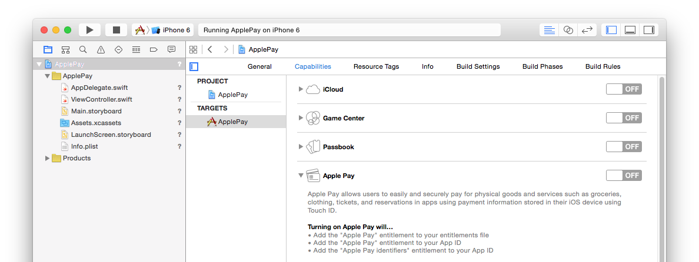
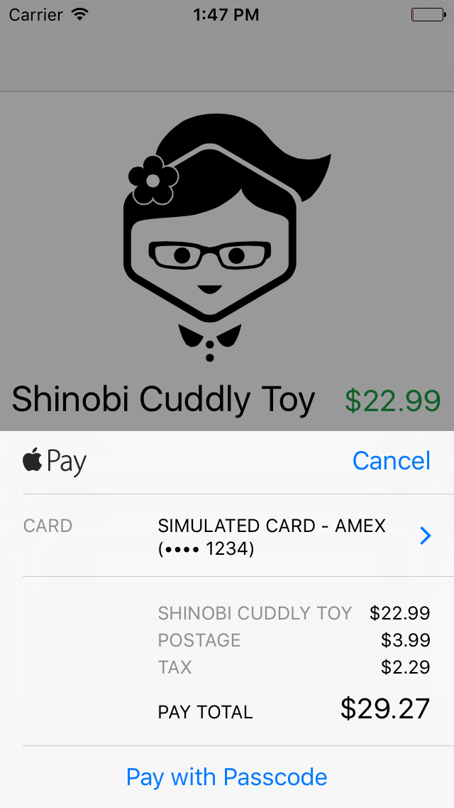
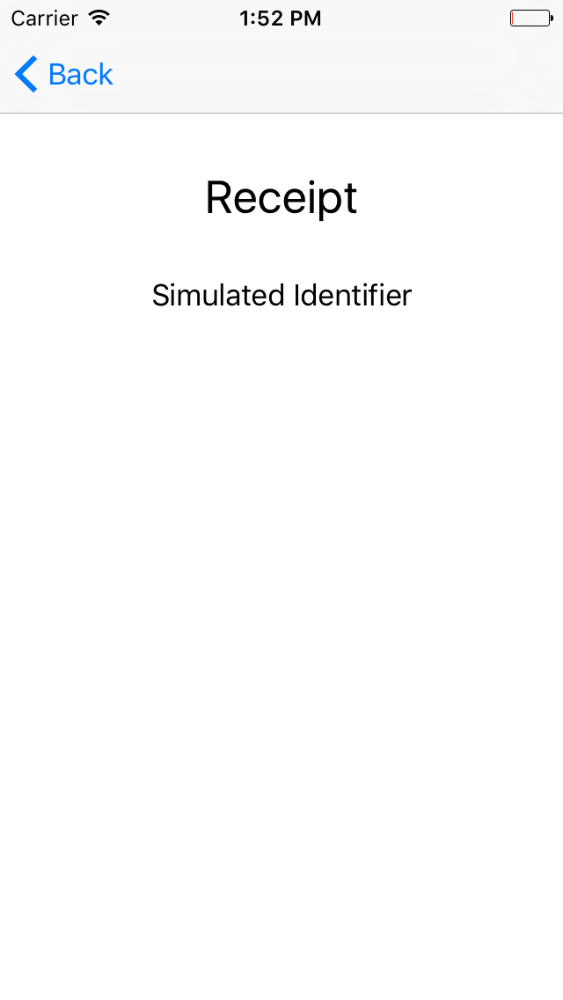

#DAY 8 :: Apple Pay

Apple Pay는 iOS 8에서 소개되었습니다. 앱 내에 실제 상품과 서비스를 위해 쉽고, 보안적이고, 비공개 방식으로 지불합니다. 유저가 거래를 인증하기 위해 지문만 요구하여 무언가를 간단하게 지불할 수 있습니다.

Apple Pay는 특정 디바이스에서만 가능합니다. 현재 가능한 디바이스는 iPhone 6, iPhone 6+, iPad Air 2 그리고 iPad mini 3입니다. Apple Pay는 Secure Element라는 전용 하드웨어 칩에 의해 지원되며, 생체 정보를 저장하고 암호화합니다.

You should **not** use Apple Pay to unlock features of your app. In App Purchase should be used in this case. Apple Pay is solely for physical goods and services, for example, club memberships, hotel reservations, and tickets for events.

앱의 기능을 여는데 Apple Pay를 사용하지 **않아야** 합니다. 이 경우에는 인앱 구매를 사용해야 합니다. Apple Pay는 물리적인 상품과 서비스만을 위합니다. 예를 들어, 클럽 멤버쉽, 호텔 예약, 이벤트 티켓 말입니다.

##왜 Apple Pay를 사용하는가?
Apple Pay는 개발자를 위한 쉬운 일이 많습니다. 여러분은 더이상 실제 카드 번호를 다루고 처리할 필요가 없고, 가입 유저도 필요 없습니다. 탐승 과정(?)에서 제거할 수 있고 유저는 더이상 계정이 필요없습니다. 배송 정보와 결제 정보는 Apple Pay 토큰과 함께 자동으로 결제 프로세서에 전달합니다. 이는 훨씬 더 높은 전환율로 이끌어 훨씬 쉬운 구매 과정을 의미합니다.

WWDC 702 세션에서, [앱 내의 Apple Pay](https://developer.apple.com/videos/wwdc/2015/?id=702), Nick Shearer는 USA에서 다른 비즈니스에서 높은 전환율 통계를 보여줬습니다.

- Stubhub는 Apple Pay 고객이 기존 고객보다 **20%** 이상 거래했음을 발견했습니다.
- OpenTable는 Apple Pay로 통합 한 후 **50%** 거래 성장했습니다.
- Staples는 Apple Pay로 **109%** 전환으로 증가했음을 보았습니다.

##간단한 스토어 앱 만들기

앱 내부에 간단한 상점을 설정하고, 어떻게 Apple Pay를 사용하여 거래가 진행되는지를 보여주려고 합니다. 앱은 한 개의 상품을 가지지만, Apple Pay로 완전히 통합되어 어떻게 Apple Pay를 설정하고 시작하는지를 보여주기위해 허용할 것입니다.

이것을 우리가 만들 것입니다. 보다시피 유저가 지금구매 버튼을 탭 할 때 Apple Pay 시트가 나타납니다.

###Apple Pay 활성화

코드를 작성하기 전에, Apple Pay로 작업하기 위해 앱 기능(capability)를 설정해야 합니다. 빈 새로운 프로젝트를 만들 때, 프로젝트 세팅을 열고, 기능 탭을 엽니다.

기능 부분에서 Apple Pay를 목록에서 볼 수 있습니다. 스위치 상태를 변경하고, 프로비져닝 사용할 개발 팀을 선택 요청받습니다. 바라건대, Xcode는 여러분과 Apple Pay가 가능하도록 모든 설정을 할 것입니다.

우리는 Merchant ID를 추가하고나서, Apple은 어떻게 결제가 정확하게 암호화하는 방법을 압니다. Merchant ID 영역에서 추가 버튼을 클릭하고, 여러분의 고유 Merchant ID를 입력합니다. 예를 들어, 우리는 `merchant.com.shinobistore.appleplay`를 선택했습니다.

되었습니다. Apple Pay가 활성화되어 있는지 볼 수 있고 앱에서 사용가능합니다.

###Apple Pay 사용

이제 우리는 정확한 프로비져닝과 권한 설정이 있으며, 사용자가 우리의 제품을 지불할 수 있도록 UI 구축 시작할 준비되었습니다. storyboard를 열고 일부 자리 UI는 제품을 판매할 수 있음을 표시합니다.

우리가 만든 UI는 제목, 가격 그리고 설명이 있는 간단한 이미지입니다. 시연에서 중요하지 않습니다. 우리는 view에 버튼을 추가해야하므로, view 아래에 추가합니다. 추가할 버튼은 `PKPaymentButton`입니다. 애플이 iOS 8.3에서 소개했습니다. 유저들이 Apple Pay를 사용할 때 Apple Pay 버튼은 지역화되고 표준 시각 표시로 유저에게 제공됩니다. 이러한 이유로 애플은 이 버튼을 사용하여 Apple Pay 화면 실행하는 것을 강력하게 추천합니다.

버튼은 세 가지 스타일이 있습니다:
	- White
    	- WhiteOutline
    	- Black

버튼은 두 가지 타입이 있습니다:
	- Plain
	- Buy

이는 버튼 스타일의 다른 방법입니다. 나쁘게도, Interface Builder에서 아직 버튼 타입 추가지원이 안되며, ViewController.swift를 열어 viewDidLoad 메소드에 오버라이드합니다.

	override func viewDidLoad() {
		super.viewDidLoad()

		let paymentButton = PKPaymentButton(type:.Buy, style:.Black)
		paymentButton.translatesAutoresizingMaskIntoConstraints = false
		paymentButton.addTarget(self, action: "buyNowButtonTapped", forControlEvents: .TouchUpInside)
		bottomToolbar.addSubview(paymentButton)

		bottomToolbar.addConstraint(NSLayoutConstraint(item: paymentButton, attribute: .CenterX, relatedBy: .Equal, toItem: bottomToolbar, attribute: .CenterX, multiplier: 1, constant: 0))
		bottomToolbar.addConstraint(NSLayoutConstraint(item: paymentButton, attribute: .CenterY, relatedBy: .Equal, toItem: bottomToolbar, attribute: .CenterY, multiplier: 1, constant: 0))
	}

이는 우리가 필요한 전부입니다. 이 코드는 따로 설명이 필요없으며 옮겨봅시다. 우리가 정말로 관심있는 유일한 UI 요소는 버튼입니다. 버튼이 탭 될때 `buyNowButtonTapped:` 메소드에서 구매 프로세스를 시작합니다.

UI가 설정되면, 구매를 진행해야 합니다. 먼저, Apple Pay 거래하는데 필요한 다양한 클래스를 완전히 이해하는 것이 좋습니다.

####PKPaymentSummaryItem
이 객체는 Apple Pay 부과 시트에 대해 과금하고 싶은 간단한 항목입니다. 예를 들어, 상품, 세금 또는 배송입니다.

####PKPaymentRequest
`PKPaymentRequest`는 유저가 지불하고 싶은 방법으로 과금하고 싶은 항목을 결합니다. 이는 Merchant ID, 국가 코드 그리고 화폐 코드 등을 포함합니다.

####PKPaymentAuthorisationViewController
`PKPaymentAuthorisationViewController`는 유저에게 `PKPaymentRequest` 인증하라고 표시하고, 배송지와 유효한 지불카드를 선택하도록 표시합니다.

####PKPayment
`PKPayment`는 지불을 처리하는데 필요한 정보를 포함하고, 그 정보는 확인 메시지를 표시하는데 필요합니다.

모든 클래스는 PassKit 아래에 있으며(따라서 접두사는 PK), 이 프레임워크를 가져와서 어디서든 Apple Pay를 사용합니다.

###지불 설정
지불을 설정하는 첫 번째 단계는 `PKPaymentRequest`를 만드는 것입니다. 관련된 몇 가지 단계가 있으며, 이는 아래에 자세히 설명되어 있습니다.

	func buyNowButtonTapped(sender: UIButton) {

		// 받길 원하는 네트워크
		let paymentNetworks = [PKPaymentNetworkAmex,
			PKPaymentNetworkMasterCard,
			PKPaymentNetworkVisa,
			PKPaymentNetworkDiscover]

먼저 허용되는 결제 네트워크 배열을 설정해야 합니다. 이는 우리가 제한하거나 특정 카드 종류를 허용하는 방법입니다.

		if PKPaymentAuthorizationViewController.canMakePaymentsUsingNetworks(paymentNetworks) {

그리고 나서, 디바이스가 결제 종류를 처리할 수 있는지 확인해야 합니다. `PKPaymentAuthorizationViewController`, `canMakePaymentsUsingNetworks` 정적 메소드는 디바이스가 결제할 수 있는지 여부를 확인합니다.

			let request = PKPaymentRequest()

			// merchantIdentifier는 Apple Pay 기능을 설정할 때 Xcode에서 만들어진 것입니다.
			request.merchantIdentifier = "shinobistore.com.day-by-day."
			request.countryCode = "US" // 표준 ISO 국가 코드. 과금하는 국가입니다.
			request.currencyCode = "USD" // 표준 ISO 통화 코드.
			request.supportedNetworks = paymentNetworks
			request.merchantCapabilities = .Capability3DS // 3DS 또는 EMV. 결제 플랫폼 또는 프로세서를 확인하세요.

이 디바이스에서 결제를 진행할 수 있는 경우, 위 코드를 사용하여 지불 요청 자체를 설정하기 시작할 수 있습니다. 각 라인의 주석은 각 라인의 효과를 설명합니다.

			// 과금할 항목을 설정합니다. 마지막 항목은 과금 총합입니다.
			let shinobiToySummaryItem = PKPaymentSummaryItem(label: "Shinobi Cuddly Toy", amount: NSDecimalNumber(double: 22.99), type: .Final)
			let shinobiPostageSummaryItem = PKPaymentSummaryItem(label: "Postage", amount: NSDecimalNumber(double: 3.99), type: .Final)
			let shinobiTaxSummaryItem = PKPaymentSummaryItem(label: "Tax", amount: NSDecimalNumber(double: 2.29), type: .Final)
			let total = PKPaymentSummaryItem(label: "Total", amount: NSDecimalNumber(double: 29.27), type: .Final)

그 후, 위와 같이 Apply Pay 시트에 표시하고자 할 상품을 설정해야 합니다. request에 paymentSummaryItems으로 이 모든 설정이 다음 줄에서 사용됩니다.

			request.paymentSummaryItems = [shinobiToySummaryItem, shinobiPostageSummaryItem, shinobiTaxSummaryItem, total]

API의 한 가지 흥미로운 부분은 배열에 마지막 항목이 실제로 유저에게 과금되는 양입니다. 처음에는 명확하지 않았지만, Apple Pay 시트는 마지막 항목에 지정된 양을 유저에게 청구합니다. 이 경우에는 전체입니다. 그러므로, 하나 이상을 결제 시트에 표시하길 바란다면 아래 처럼 전체를 계산하고 리스트 마지막에 `PKPaymentSummaryItem`를 추가합니다.

			// request로부터 PKPaymentAuthorizationViewController를 만듭니다.
			let authorizationViewController = PKPaymentAuthorizationViewController(paymentRequest: request)

			// 결제 인증 결과를 알도록 델리게이트를 설정합니다.
			authorizationViewController.delegate = self

			// 유저에게 authorizationViewController를 보여줍니다.
			presentViewController(authorizationViewController, animated: true, completion: nil)

마지막으로, 유저에게 Apple Pay 시트를 나타내기 위해 남기는 모든 것은 request로부터 `PKPaymentAuthorizationViewController`를 만들며, 델리게이트를 설정하고, 유저에게 나타냅니다.

`PKPaymentAuthorizationViewController`에서 델리게이트 메소드를 구현했는지 확인해야 합니다. 메소드를 구현해야하며 결제가 되었는지 안되었는지, 그리고 결제가 인증되고 완료되었을 때 콜백을 받았는지를 압니다.

`paymentAuthorizationViewController:didAuthorizePayment`에서 공급자와 지불 데이터를 처리하고 우리 앱으로 상태를 반환받아야 합니다. 이 메소드에서 받는 `PKPayment` 객체는 `PKPaymentToken` 토큰 속성을 가지며, 이는 결제 공급자에게 전달해야하는 것입니다.

	func paymentAuthorizationViewController(controller: PKPaymentAuthorizationViewController, didAuthorizePayment payment: PKPayment, completion: (PKPaymentAuthorizationStatus) -> Void) {

		paymentToken = payment.token

		// payment.token를 사용하여 Stripe 처럼 일반적으로 지불 공급자를 사용합니다.
		completion(.Success)

		// 지불이 성공할 때 유저에게 구매가 성공적이었다고 보여줍니다.
		self.performSegueWithIdentifier("purchaseConfirmed", sender: self)
	}

`paymentAuthorizationViewControllerDidFinish`에서 간단하게 view controller를 사라지게 해야합니다.

	func paymentAuthorizationViewControllerDidFinish(controller: PKPaymentAuthorizationViewController) {
		self.dismissViewControllerAnimated(true, completion: nil)
	}

그게 전부입니다. 현실 세계에서 결제 공급자에게 결제 토큰을 전달해야 합니다 Stripe 같이, 그러나 이는 이 튜토리얼 범위를 넘어갑니다. 우리는 간단한 view controller에 영수증을 보여주도록 추가했으며, 이 경우에는 결제 토큰의 `transactionIdentifier`를 보여줍니다. 이것은 문자열로 전역 고유 식별자를 설명하며 거래를 위함입니다. 이 거래는 영수증 목적을 위해 사용되어질 수 있습니다.

##더 읽을 거리
Apple Pay에 더 많은 정보로 WWDC 702 세션인 [앱 내의 Apple Pay](https://developer.apple.com/videos/wwdc/2015/?id=702)를 보는 것을 추천합니다. 꽤나 긴 세션이지만, 여러분의 어플리케이션에 Apple Pay 통합하는데 관심이 있다면 확실히 볼 가치가 있습니다. 어떻게 여러분의 앱에 결제 처리의 유저 경험을 향상시키는 방법에 대한 중간에 훌륭한 세션입니다.

애플 개발자 웹사이트에도 [Apple Pay 안내](https://developer.apple.com/apple-pay/)가 있으며, 유용한 정보를 많이 포함하며 Apple Pay 통합하기 전에 잘 알고 있어야 합니다.

잊지마세요. 우리가 이 글에서 만들고 설명된 프로젝트를 시도할 경우, [GitHub](https://github.com/shinobicontrols/iOS9-day-by-day/tree/master/08-Apple-Pay)를 통해 찾을 수 있습니다.
