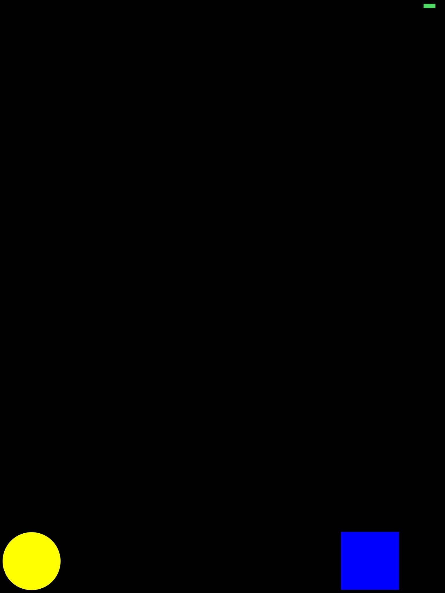
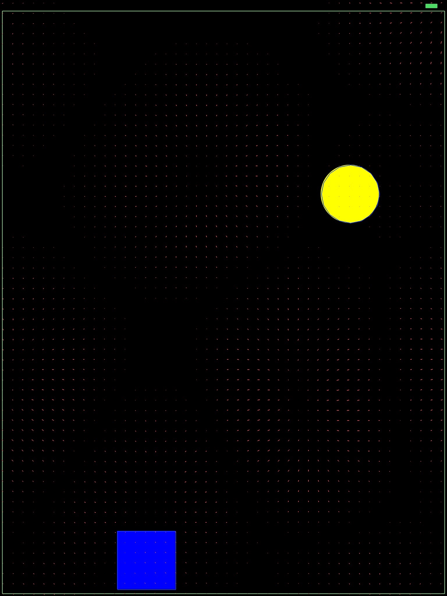

# Day 9 :: UIKit Dynamics

UIKit Dynamics는 iOS 7에서 소개되었다. 개발들이 물리적인 현실성을 유저 인터페이스에 쉽게 더하기 위해서 iOS 9에서는 몇 가지 큰 발전들이 있었다. 우리는 이제 이 포스트를 통해 그것을 볼 것이다.

## 직사각형이 아닌 충돌 경계

iOS 9 이전에는 UIKitDynamics의 충돌 경계는 직사각형이어야만 했다. 이런 특성은 완전히 직사각형이 아닌 뷰들의 충돌에서 이상한 visual effect들을 만들어냈다. 이제 iOS 9에서는 3가지 충돌경계 타입을 지원한다. 직사각형, 타원, 패스(path). 패스는 어떤것도 될 수 있다. 스스로 교차하지 않고, 반시계방향으로 길게 늘어날 수 있다. 한가지 주의 사항이 있다. 패스는 볼록한 모양이어야한다. 절대 오목한 모양이어서는 안된다.

제공되는 세 가지 충돌 경계 타입들에 따라 UIView를 상속하여 스스로의 경계 타입을 만들 수 있다.

```swift
class Ellipse: UIView {
  override var collisionBoundsType: UIDynamicItemCollisionBoundsType
  {
    return .Ellipse
  }
}
```

커스텀 뷰를 가지고 있다면 커스텀 충돌 경계 패스를 같은 형태로 만들 수 있다.

## UIFieldBehavior

iOS 9 이전에는 중력(gravity) behaviour만이 field behaviour 타입으로 제공되었다. UIFieldBehavior는 쭉 있었지만, 사용자에게 상속받을 수 있는 SDK로 제공되지 않았다.

이제 UIKit Dynamics는 여러 가지 field behaviour를 가지고 있다.

- Linear Gravity 선형 중력
- Radial Gravity 방사형 중력
- Noise
- Custom

이들 behaviour들은 UIDynamicAnimator에서 뷰들에 영향을 줄 수있는 여러 가지 변경 가능한 다양한 성질들을 가지고 있다. 그리고 매우 쉽게 추가하고 사용할 수 있다.

## UIFieldBehavior 만들기 & 직사각형이 아닌 충돌 경계 예제

이 새로운 두 기능으로 예제를 만들어보자. 타원형과 정사각형의 한 쌍의 뷰에 충돌 로직과 noise UIFieldBehavior를 추가해 보겠다.


UIKit Dynamics를 사용하기 위해서는 우선 UIDynamicAnimator를 설정해야 한다. 클래스에서 `viewDidLoad` 메소드에서 설정 후 계속 참조하여 쓰자.

```swift
// Set up a UIDynamicAnimator on the view.
animator = UIDynamicAnimator(referenceView: view)
```

실제로 움직일 뷰를 추가해보자.

```swift
// Add two views to the view
let square = UIView(frame: CGRect(x: 0, y: 0, width: 100, height: 100))
square.backgroundColor = .blueColor()
view.addSubview(square)

let ellipse = Ellipse(frame: CGRect(x: 0, y: 100, width: 100, height: 100))
ellipse.backgroundColor = .yellowColor()
ellipse.layer.cornerRadius = 50
view.addSubview(ellipse)
```

behaviour를 추가할 두 개의 기본 뷰가 준비되었다.

```swift
let items = [square, ellipse]

// Create some gravity so the items always fall towards the bottom.
let gravity = UIGravityBehavior(items: items)
animator.addBehavior(gravity)
```

gravity behavior를 첫 번째 behavior로 생성한다.

```swift
let noiseField:UIFieldBehavior = UIFieldBehavior.noiseFieldWithSmoothness(1.0, animationSpeed: 0.5)
// Set up the noise field
noiseField.addItem(square)
noiseField.addItem(ellipse)
noiseField.strength = 0.5
animator.addBehavior(noiseField)
```

다음 behavior로 `noiseFieldWithSmoothness` 설정값을 이용하여 `UIFieldBehavior를` 설정한다. 정사각형과 타원을 behavior에 추가하고, animator에 field behavior를 추가한다.

```swift
// Don't let objects overlap each other - set up a collide behaviour
let collision = UICollisionBehavior(items: items)
collision.setTranslatesReferenceBoundsIntoBoundaryWithInsets(UIEdgeInsets(top: 20, left: 5, bottom: 5, right: 5))
animator.addBehavior(collision)
```

아이템에 `UICollisionBehavior`를 설정한다. 서로 겹쳐지는것을 방지하도록 animator에 collision physics를 추가한다. `setTranslatesReferenceBoundsIntoBoundaryWithInsets`을 이용한다. 뷰 주변에 경계 박스를 만들어 경계를 볼 수 있게 해준다. 경계 박스가 없다면 중력에 의해 타원과 사각형은 스크린 바닥으로 떨어져서 돌아오지 않을 것이다!

중력의 경우 예제에서와같이 항상 디바이스의 바닥을 향하도록 하는 것이 좋다. 다시 말하면 실생활의 중력 방향과 방향으로 만들기 위해 우리는 CoreMotion framework를 이용해야 한다. CoreMotion을 import하고, CMMotionManager 변수를 생성하자.

```swift
let manager:CMMotionManager = CMMotionManager()
```

계속 업데이트 받기위해서는 레퍼런스를 유지해야 하므로 프로퍼티가 필요하다. 그렇지 않으면 메지너는 릴리스되어 업데이트되지 않을 것이다. 한번 디바이스 모션 업데이트를 받기 시작하면, 디바이스 메니져의 `gravity` 프로퍼티를 기반으로 gravity behavior의 `gravityDirection` 프로퍼티를 실제 아래 방향으로 업데이트 할 수 있다.

```swift
// Used to alter the gravity so it always points down.
if manager.deviceMotionAvailable {
  manager.deviceMotionUpdateInterval = 0.1
  manager.startDeviceMotionUpdatesToQueue(NSOperationQueue.mainQueue(), withHandler:{
    deviceManager, error in
    gravity.gravityDirection = CGVector(dx: deviceManager!.gravity.x, dy: -deviceManager!.gravity.y)
  })
}
```

portrait orientation일 때만 작동한다는 것을 기억하자. 앱에서 모든 device orientation을 다 지원하기 원한다면, 추가적인 계산을 할 필요가 있다.

지금 앱을 실행시킨다면, 당신은 아래와 같은 화면을 보게 될 것이다.



사각형들이 돌아다니겠지만, 실제로 뭐가 일어나고 있는지는 볼수 없을것이다. 애플은 WWDC session 229에서 animator에 적용된 효과들을 시각적으로 디버깅 할 수있는 방법을 발표했다. swift로 프로젝트를 작성중이라면 bridging header만 추가하고 아래 코드를 추가하면 된다.

```swift
@import UIKit;

#if DEBUG

@interface UIDynamicAnimator (AAPLDebugInterfaceOnly)

/// Use this property for debug purposes when testing.
@property (nonatomic, getter=isDebugEnabled) BOOL debugEnabled;

@end

#endif
```
이것은 디버그 모드를 켜서 `UIDynamicAnimator의` private API 몇 개를 사용할 수 있게 해준다. 이것은 뷰에 작용하고 있는 힘들을 볼 수 있게 해준다. `ViewController` 클래스로 돌아가서 animator의 `debugEnabled` 프로퍼티를 설정할 수 있다.

```swift
animator.debugEnabled = true // Private API. bridging header 참고.
```

이제 앱을 실행시켜보자. UIFieldBehavior에의해 적용된 힘들을 볼 수 있게 되었다.



타원과 사격형 주변과 뷰의 충돌 경계 주변의 경계 박스를 볼 수 있다. API에서 제공하는 하지않지만 lldb에서 사용가능한 프로퍼티가 두 개 있다. `debugInterval`과 `debugAnimationSpeed`로, UIKit Dynamics 애니메이션을 디버깅 할 때 추가적인 도움을 줄 수 있다.

뷰들에 적용되는 힘과 장(field)을 볼수게 되었다. 장(field)의 프로퍼티들을 변경하고 싶다면, 일반적으로 오브젝트에 숫자를 설정하고 변경된 사항들을 적용하기 위해 다시 실행해야만 했다. 이런 종류의 일들은 실시간으로 조절할 수있는 몇 가지 콘트롤들을 추가함으로써 종종 훨씬 쉽게 할 수 있다. 인터페이스 빌더를 열어서 `UISlide` 콘트롤 3개를 추가하자. 첫 번째는 세기를, 두 번째는 부드러움, 마지막은 속도를 조절할 것이다. 세기 슬라이더는 0 - 25, 나머지 것들은 0 - 1로 스케일을 설정한다.


인터페이스 빌더에서 추가한 후에 `ViewController` 클래스에 value changed action을 드레그하여 각각 프로퍼티들이 적절하게 업데이트되도록 하자.

```swift
@IBAction func smoothnessValueChanged(sender: UISlider) {
  noiseField.smoothness = CGFloat(sender.value)
}

@IBAction func speedValueChanged(sender: UISlider) {
  noiseField.animationSpeed = CGFloat(sender.value)
}

@IBAction func strengthValueChanged(sender: UISlider) {
  noiseField.strength = CGFloat(sender.value)
}
```
이제 앱을 실행하면, 세 가지 프로퍼티을 조절할 수 있다. 그리고 다른 조합들이 어떤 효과를 내는지도 볼 수 있다.


UIKit Dynamics의 새로운 UIFieldBehavior와 non-rectangular collision bounds API들을 어떻게 사용하고, 디버깅하는지에 대해 좋은 개략적인 설명이 되기를 희망한다. 시뮬레이터에서는 모션센서의 효과를 완전히 체험할 수 없기에 실제 기기에서 실행해보기를 추천한다.

## 추가적인 읽을거리

새로운 UIKit Dynamics의 기능들에 대한 추가적은 정보들은 WWDC session 229 [What's New in UIKit Dynamics and Visual Effects](https://developer.apple.com/videos/wwdc/2015/?id=229)의 전반부를 보기를 추천한다. 이글에서 설명한 프로젝트들을 실행해보고 싶다면 [GitHub](https://github.com/shinobicontrols/iOS9-day-by-day/tree/master/09-UIKit-Dynamics)에 있으니 잊지 말기 바란다.
