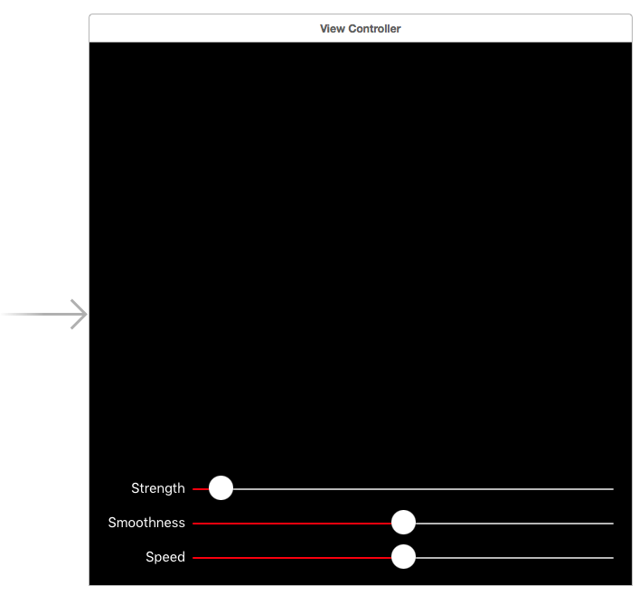

# 제9일 :: 새로운 UIKit Dynamics 기능들

UIKit Dynamics는 iOS 7에서 소개되었다. 개발들이 물리적인 현실성을 user interface에 쉽게 더하기위해서. iOS 9에서는 몇가지 큰 발전들이 있었다. 우리는 이제 이 post를 통해 그걸을 볼것이다.

## 직사각형이 아닌 충돌 경계

iOS 9 이전에는 UIKitDynamics의 충돌 경계는 직사각형이어야만 했다. 이런 특성은 완전히 직사각형이 아닌 view들의 충돌에서 이상한 visual effect들을 만들어냈다. 이제 iOS 9에서는 3가지 충돌경계 type을 지원한다. 직사각형, 타원, path. path는 어떤것도 될수있다.  스스로 교차하지 않고, 반시계방향으로 길게 늘어날수 있다. 한가지 주의 사항이 있다. path는 볼록한 모양이어야한다. 절대 오목한 모양이어서는 안된다.

제공되는 세가지 충돌 경계 타입들에 따라 UIView를 상속하여 스스로의 경계 타입을 만들수있다.

```swift
class Ellipse: UIView {
	override var collisionBoundsType: UIDynamicItemCollisionBoundsType
	{
		return .Ellipse
	}
}
```

custom View를 가지고 있다면 custom 충돌 경계 path를 동일한 형태로 만들수있다.

## UIFieldBehavior

iOS 9 이전에는 gravity(중력) behaviour만이 field behaviour type으로 제공되었다. UIFieldBehavior는 쭉 있어왔지만, 사용자에게 상속받을 수있는 SDK로 제공되지 않았다.

이제 UIKit Dynamics는 여러가지 field behaviour를 가지고 있다.

- Linear Gravity 선형 중력
- Radial Gravity 방사형 중력
- Noise
- Custom

이들 behaviour들은 UIDynamicAnimator에서 view들에 영향을 줄수있는 여러가지 변경가능한 다양한 성질들을 가지고 있다. 그리고 매우 쉽게 추가하고 사용할수있다.

## UIFieldBehavior 만들기 & 직사각형이 아닌 충돌 경계 예제

이 새로운 두 기능을 가지고 예제를 만들어보자. 타원형과 정사각형의 한쌍의 view에 총돌 로직과 noise UIFieldBehavior를 추가해 보겠다.


UIKit Dynamics를 사용하기위해서는 우선 UIDynamicAnimator를 설정해야한다. Class에서 viewDidLoad method에서 설정후 계속 참조하여 쓰자.

```swift
// Set up a UIDynamicAnimator on the view.
animator = UIDynamicAnimator(referenceView: view)
```

실재로 움직일 view들을 추가해보자.

```swift
// view에 view 2개를 추가한다.
let square = UIView(frame: CGRect(x: 0, y: 0, width: 100, height: 100))
square.backgroundColor = .blueColor()
view.addSubview(square)
let ellipse = Ellipse(frame: CGRect(x: 0, y: 100, width: 100, height: 100))
ellipse.backgroundColor = .yellowColor()
ellipse.layer.cornerRadius = 50
view.addSubview(ellipse)
```

behaviour를 추가할 두개의 기본 view가 준비되었다.

```swift
let items = [square, ellipse]
// 아이탬들이 항상 바닥으로 떨어지도록 중력을 생성한다.
let gravity = UIGravityBehavior(items: items)
animator.addBehavior(gravity)
```

gravity behavior를 첫번째 behavior로 생성한다.


```swift
let noiseField:UIFieldBehavior =
UIFieldBehavior.noiseFieldWithSmoothness(1.0, animationSpeed: 0.5)
// noise field를 설정한다.
noiseField.addItem(square)
noiseField.addItem(ellipse)
noiseField.strength = 0.5
animator.addBehavior(noiseField)
```

다음 behavior로 noiseFieldWithSmoothness 설정값을 이용하여 UIFieldBehavior를 설정한다. 정사각형과 타원을 behavior에 추가하고, animator에 field behavior를 추가한다.

```swift
// collision behavior를 설정하여 각각의 object들이 겹쳐지지 않게 한다.
let collision = UICollisionBehavior(items: items)
collision.setTranslatesReferenceBoundsIntoBoundaryWithInsets(UIEdgeInsets(top: 20, left: 5, bottom: 5, right: 5))
animator.addBehavior(collision)
```
item들에 UICollisionBehavior를 설정한다. 서로 겹쳐지는것을 방지하도록 animator에 collision physics를 추가한다. setTranslatesReferenceBoundsIntoBoundaryWithInsets을 이용한다. view 주변에 경계 박스를 만들어 경계를 볼수있게 해준다. 경계 박스가 없다면 중력에 의해 타원과 사각형은 스크린 바닥으로 떨어져서 돌아오지 않을것이다!

중력의 경우 예제에서와 같이 항상 디바이스의 바닥을 향하도록 하는것이 좋다. 다시말하면 실생활의 중력방향과 방향으로 만들기 위해 우리는 CoreMotion framework를 이용해야한다. CoreMotion을 import하고, CMMotionManager 변수를 생성하자.

```swift
let manager:CMMotionManager = CMMotionManager()
```

계속 업데이트 받기위해서는 reference를 유지해야하기때문에 property가 필요하다. 그렇지 않으면 manager는 release되어 update되지 않을 것이다. 한번 device motion update를 받기 시작하면, device manager의 gravity property를 기반으로 gravity behavior의 gravityDirection property를 실재 아래 방향으로 업데이트 할수있다.

```swift
// 중력방향이 항상 아래로 향하도록 변경하는데 사용한다
if manager.deviceMotionAvailable {
	manager.deviceMotionUpdateInterval = 0.1
	manager.startDeviceMotionUpdatesToQueue(NSOperationQueue.mainQueue(), withHandler:{
        deviceManager, error in
		gravity.gravityDirection = CGVector(dx: deviceManager!.gravity.x, dy: -deviceManager!.gravity.y)
	})
}
```

portrait orientation일때만 작동한다는것을 기억하자. app에서 모든 device orientation을 다 지원하기 원한다면, 추가적인 계산을 할 필요가 있다.

지금 앱을 실행시킨다면, 당신은 아래와 같은 화면을 보게 될것이다.


사각형들이 돌아다니겠지만, 실재로 뭐가 일어나고 있는지는 볼수 없을것이다. 애플은 WWDC session 229에서 animator에 적용된 효과들을 시각적으로 디버깅 할수있는 방법을 발표했다. swift로 프로젝트를 작성중이라면 bridging header만 추가하고 아래 코드를 추가하면 된다.

```swift
@import UIKit;

#if DEBUG

@interface UIDynamicAnimator (AAPLDebugInterfaceOnly)

/// test할때 디버깅 용도로 이 property를 사용하자
@property (nonatomic, getter=isDebugEnabled) BOOL debugEnabled;

@end

#endif
```
이것은 디버그 모드를 켜서 UIDynamicAnimator의 private API 몇개를 사용할수 있게 해준다. 이것은 뷰에 작용하고 있는 힘들을 볼수있게 해준다. ViewController Class로 돌아가서 animator의 debugEnabled property를 설정할수있다.

```swift
animator.debugEnabled = true // Private API. bridging header 참고.
```

이제 앱을 실행시켜보자. UIFieldBehavior에의해  적용된 힘들을 볼수있게 되었다.


타원과 사격형 주변과 뷰의 충돌 경계 주변의 경계 박스를 볼수있다. API에서 제공하는 하지않지만 lldb에서 사용가능한 property가 두개 있다. debugInterval과 debugAnimationSpeed로, UIKit Dynamics animation을 디버깅 할때 추가적인 도움을 줄수있다.

뷰들에 적용되는 힘과 장(field)을 볼수게 되었다. field의 property들을 변경하고 싶다면, 일반적으로 object에 숫자를 설정하고 변경된 사항들을 적용하기 위해 다시 실행해야만 했다. 이런 종류의 일들은 실시간으로 조절할수있는 몇가지 control들을 추가함으로서 종종 훨씬 쉽게 할수있다. interface builder를 열어서 UISlide control 3개를 추가하자. 첫번째는 세기를, 두번째는 부드러움, 마지막은 속도를 조절할것이다. 세기 slider는 0 - 25, 나머지 것들은 0 - 1로 scale을 설정한다.



Interface Builder에서 추가한 후에 ViewController Class에 value changed action을 drag하여 각각 property들이 절적하게 update되도록 하자.

```swift
@IBAction func smoothnessValueChanged(sender: UISlider) {
	noiseField.smoothness = CGFloat(sender.value)
}

@IBAction func speedValueChanged(sender: UISlider) {
	noiseField.animationSpeed = CGFloat(sender.value)
}

@IBAction func strengthValueChanged(sender: UISlider) {
	noiseField.strength = CGFloat(sender.value)
}
```
이제 앱을 실행하면, 세가지 property들을 조절할수 있다. 그리고 다른 조합들이 어떤 효과를 내는지도 볼수있다.


UIKit Dynamics의 새로운 UIFieldBehavior와 non-rectangular collision bounds API들을 어떻게 사용하고, 디버깅하는지에 대해 좋은 개략적인 설명이 되기를 희망한다. 시뮬레이터에서는 모션센서의 효과를 완전히 체험할수 없기에 실제 기기에서 실행해보기를 추천한다.

##추가적인 읽을 거리
새로운 UIKit Dynamics의 기능들에 대한 추가적은 정보들은 WWDC session 229 [What's New in UIKit Dynamics and Visual Effects](https://developer.apple.com/videos/wwdc/2015/?id=229)의 전반부를 보기를 추천하다. 이글에서 설명한 프로젝트들을 실행해보고 싶다면 [GitHub](https://github.com/shinobicontrols/iOS9-day-by-day/tree/master/09-UIKit-Dynamics)에 있으니 잊지 말기 바란다.
