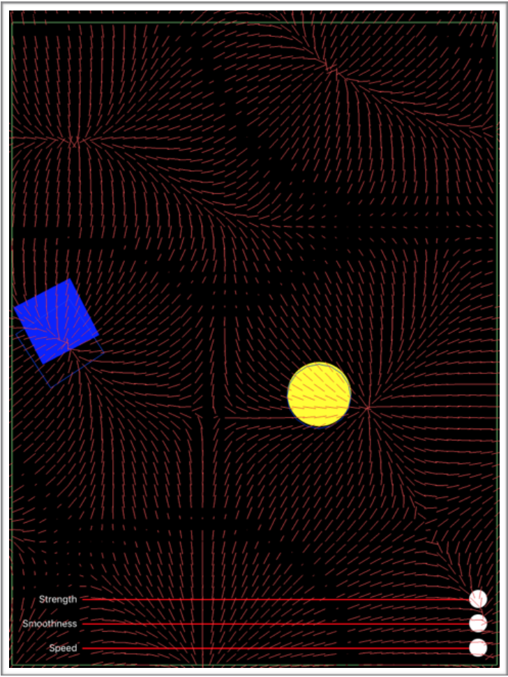
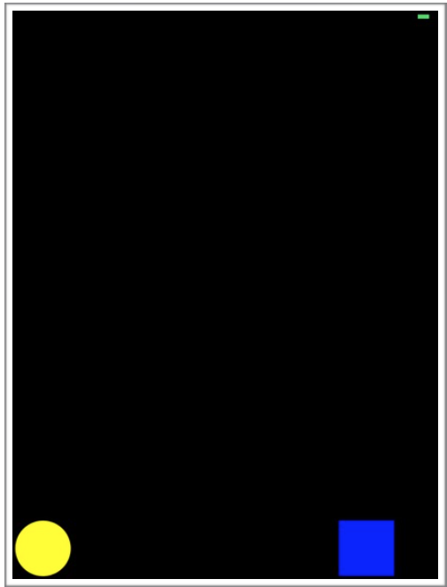
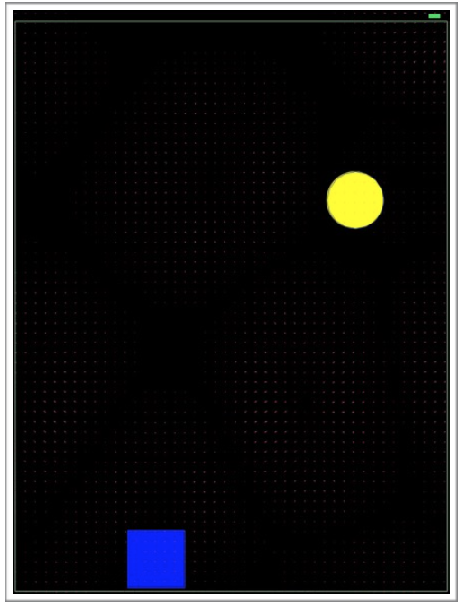
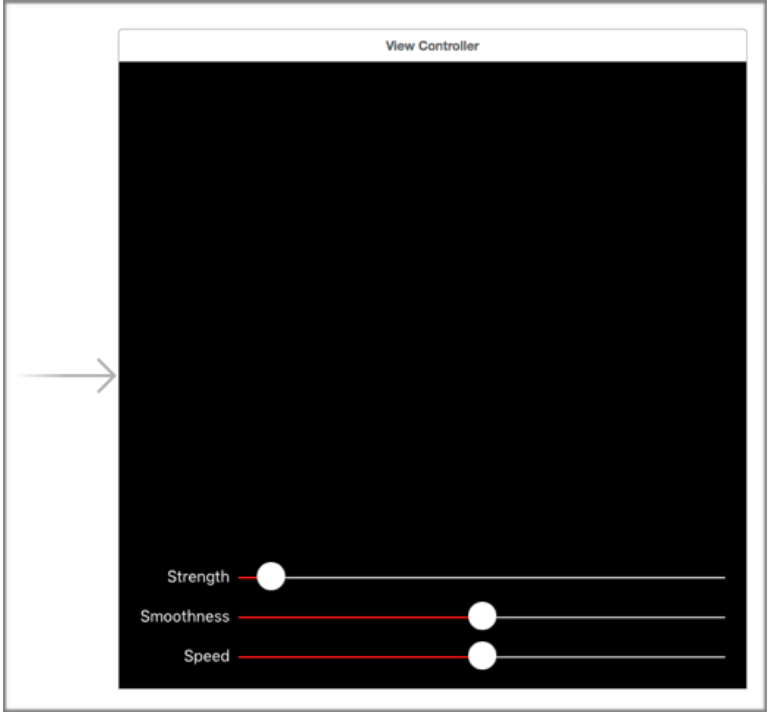
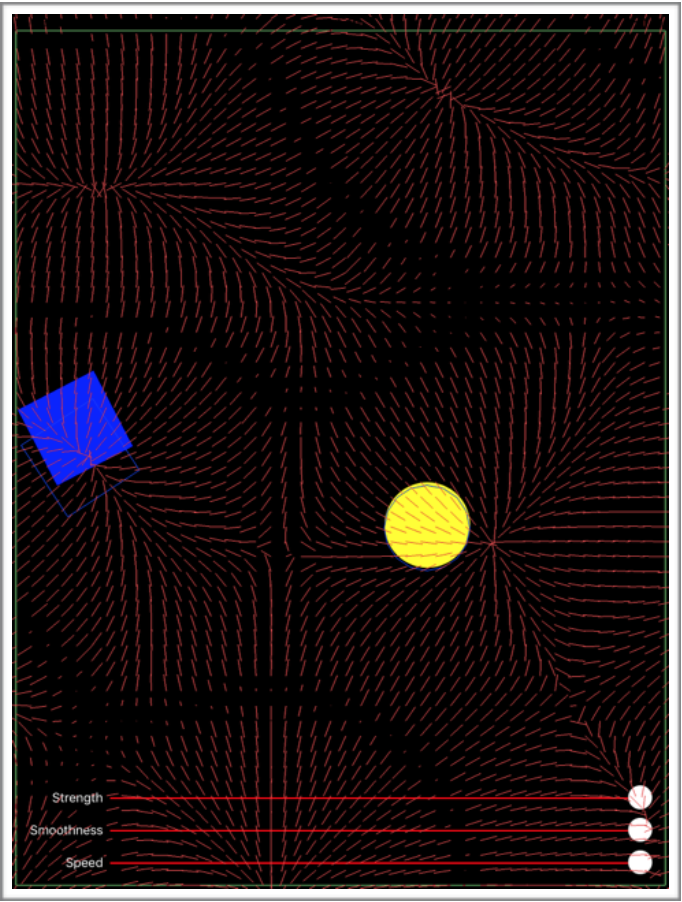

#Day 9 :: New UIKit Dynamics Features
UIKit Dynamics는 개발자들에게 더 쉽게 물리적 사실감을 유저인터페이스에 표현하기위해, iOS 7버젼에서 소개되었다. iOS 9 에서 몇가지 큰 개선을 했고 이중 일부를 살표볼 것이다.

## Non-Rectangular Collision Bounds (비사각형 충돌 바운드)
iOS 9 이전에는, UIKitDynamics의 충돌 바운드는 사각형만 가능했다. 때문에 사각형이 아닌 물체의 충돌은 시각적으로 어색한 효과를 가져왔다. iOS 9 은 이제 세가지 충돌 바운드를 가질 수 있다. Rectengular(사각형), Ellipse(타원형), 및 Path(경로)다. Path는 반시계 방향이고 자신과 교차가 아닌이상 아무것이나 될 수 있다. 허나 주의해야할점이 있다. Path는 **볼록** 해야하며 오목 하지 않아야된다. 커스텀 바운드 타입을 제공하기 위해, UIView를 하위클래스로 제공하면 된다.
```swift
class Ellipse: UIView {
    override var collisionBoundsType: UIDynamicItemCollisionBoundsType
    {
	return .Ellipse
	}
}
```
커스텀 뷰에 커스텀 충돌 바운드 Path 역시 같은 방법으로 구현 할 수 있다.

##UIFieldBehavior
iOS 9 이전엔, 유일한 필드 형태는 중력뿐이었다. 이게 UIFieldBehavior의 전부였지만 API는 유저에게 subclass 할수있도록 제공되지 않았다.
이제는, UIKit Dynamics가 다양한 필드 형태을 제공한다:
- Linear Gravity
- Radial Gravity
- Noise
- Custom
이러한 형태는 UIDynamicAnimatory에서 뷰에 다양한 효과를 줄때 커스터마이즈를 하기 위한 다양한 프로퍼티를 갖고있다. 그리고 쉽게 추가 할 수 있다.

##UIFieldBehavior 만들기 & Non-Rectangular Collision Bounds 예제
위 두가지를 결합하여 예제를 만들어보자. 몇가지 새로운 뷰(타원, 사각형)와, 충돌 로직, noise UIFieldBehavior을 이용한다.



```swift
   // 뷰 위에 UIDynamicAnimator 설정.
   animator = UIDynamicAnimator(referenceView: view)
```
이제 몇가지 애니메이션을 위한 뷰를 추가해본다.
```swift
   // view에 두개의 뷰를 추가한다
   let square = UIView(frame: CGRect(x: 0, y: 0, width: 100, height:
   100))
   square.backgroundColor = .blueColor()
   view.addSubview(square)
   let ellipse = Ellipse(frame: CGRect(x: 0, y: 100, width: 100, height:
   100))
   ellipse.backgroundColor = .yellowColor()
   ellipse.layer.cornerRadius = 50
   view.addSubview(ellipse)
```
위에 두가지가 필드 형태를 추가할 두 뷰다.
```swift
	let items = [square, ellipse]
   // 중력을 만들어서 item들이 항상 아래로 떨어질 수 있게 만든다
   let gravity = UIGravityBehavior(items: items)
   animator.addBehavior(gravity)
   The first behavior we create is a gravity behavior.
   let noiseField:UIFieldBehavior =
   UIFieldBehavior.noiseFieldWithSmoothness(1.0, animationSpeed: 0.5)
   // noise field 를 설정한다
   noiseField.addItem(square)
   noiseField.addItem(ellipse)
   noiseField.strength = 0.5
   animator.addBehavior(noiseField)
```
다음은 `noiseFieldWithSmoothness`이니셜라이저를 사용해서  `UIFieldBehavior`을 설정한다. 이것에 사각형과 타원을 추가하고, 필드형태를 애니메이터에 추가해준다.
```swift
   // 오브젝트가 서로 겹치지않게 한다 - 충돌을 설정한다
   let collision = UICollisionBehavior(items: items)
   collision.setTranslatesReferenceBoundsIntoBoundaryWithInsets(UIEdgeIns
   ets(top: 20, left: 5, bottom: 5, right: 5))
   animator.addBehavior(collision)
```
items에 `UICollisionBehavior`를 설정해 겹치는것을 방지하며 물리적 충돌을 애니메이터에 추가합니다. 또한 `setTranslatesReferenceBoundsIntoBoundaryWithInsets`를 이용해 뷰 주위에 바운딩 박스를 만들고 insets를 설정해 바운딩박스가 보이게 할수있다. 만약 바운딩박스가 없다면 중력이 타원과 사각형을 화면 밖으로 떨어뜨릴것이다!!

중력에 대해 얘기 하자면, 중력이 항상 디바이스의 아래 방향으로 향하면 좋을것이다. 다른말로 얘기하자면 중력이 현실과 같게 설정하기위해 CoreMotion framework 를 사용하면된다. CoreMotion 을 임포트 하고 CMMotionManager 변수를 만들자.
```swift
   let manager:CMMotionManager = CMMotionManager()
```
지속적인 업데이트를 받기 위해서 프로퍼티가 필요하다. 안그러면 manager가 release(해제) 되서 업데이트가 불려지지 않을것이다. 디바이스 모션 업데이트를 받기 시작하면, 중력의 'gravityDirection' 프로퍼티를 deviceManger저의 중력을 이용해 실제 디바이스의 아래 방향으로 업데이트 할 수 있다.
```swift
   // 항상 아래를 가리키도록 중력을 변경하는데 사용
   if manager.deviceMotionAvailable {
       manager.deviceMotionUpdateInterval = 0.1
       manager.startDeviceMotionUpdatesToQueue(NSOperationQueue.mainQueue(), withHandler:{
           deviceManager, error in
           gravity.gravityDirection = CGVector(dx:
           deviceManager!.gravity.x, dy: -deviceManager!.gravity.y)
   })
}
```
주의할점은 이것이 portrait orientation에 대해서만 작동할 것이다. 모든 방향의 orientation에 대해 작동하길 원하면 추가적인 계산을 해야될 것이다! 이제 실행을 해보면 다음과 같은 화면이 보일 것이다.



사각형이 돌아다닐것이다, 하지만 실제로 무슨일이 일어나는지 알수없다! WWDC 세션 229에서 애플은 애니메이션 이팩트에 의한 비쥬얼 디버깅에 대해 공개했다. 브리징 해더만 추가하면 된다 (swift로 프로젝트를 할시). 그리고 다음 코드를 추가하자.
```swift
@import UIKit;
#if DEBUG
   @interface UIDynamicAnimator (AAPLDebugInterfaceOnly)
   /// 테스트할때 디버깅을 위해 사용할 프로퍼티
   @property (nonatomic, getter=isDebugEnabled) BOOL debugEnabled;
@end #endif
```
이것은 디버깅 모드를 켤 수 있게 UIDynamicAnimator의 private API를 제공한다. 이제 뷰에 적용되는 힘을 볼 수 있다. 다시 ViewController 클래스에 가서 animator에 debugEnabled 프로퍼티를 true로 바꿔준다.
```swift
   animator.debugEnabled = true // Private API. See the bridging header.
```
이제 실행해보면 UIFieldBehavior 에서 힘이 작용하는걸 시각적으로 볼 수 있다 (스크린샷으로는 잘 안보이나 실행해보면 알 수 있다)



이제 뷰의 충돌 영역에 해당하는 바운딩 박스 또한 볼 수 있다. 타원과 사각형 역시 마찬가지로 볼 수 있다! 이 외에 API에서 제공하지 않지만 lldb에 있는 다른 프로퍼티 또한 추가 할 수 있다. `debugInterval`과 `debugAnimationSpeed`이 이에 해당된다. UIKit Dynamics 애니메이션 디버깅에 대한 추가적인 도움말이 추가 되었으면 한다.
이제 필드가 잘 작동하고 힘이 적용하는 것을 볼 수 있다.필드의 프로퍼티를 조정하려면 일반적으로 오브젝트에 숫자를 코딩해서 앱을 재실행 할것이다. 이러한 작업을 간단히 실시간으로 하기 위해 몇가지 컨트롤을 추가할것이다, 그게 테스트를 하기 위해 더 편하고 쉽다. 인터페이스 빌더를 열고 UISlider 를 세개 추가하자. 첫번째는 강도, 두번째는 부드러움, 마지막은 속도를 조절할것이다. 강도는 0~25, 다른 두가지는 0~1로 설정하면 된다.



인터페이스 빌더에서 추가를 한후, value changed 에 대한 IBAction을 ViewController 클래스 에 드래그 해서 만든다. 그리고 액션에 대한 업데이트를 다음과 같이 설정해준다.
```swift
   @IBAction func smoothnessValueChanged(sender: UISlider) {
       noiseField.smoothness = CGFloat(sender.value)
   }
   @IBAction func speedValueChanged(sender: UISlider) {
       noiseField.animationSpeed = CGFloat(sender.value)
   }
   @IBAction func strengthValueChanged(sender: UISlider) {
       noiseField.strength = CGFloat(sender.value)
   }
```
앱이 실행되면, 위의 세가지 프로퍼티를 조작해 어떠한 조합이 어떠한 효과를 내는지 볼 수 있다.



UIKit Dynamics에 UIFieldBehavior 및 non-rectangular collision bound API에 대해 사용하고 디버깅 하는것에 대해 좋은 참고가 됐길 바란다. 나는 실제 디바이스에서 앱을 실행해보는 것을 추천한다, 시뮬레이터로는 모션센서에 대한 모든 효과를 볼 수 없다!
##Further Reading
UIKit Dynamics 에 대한 추가적인 정보를 더 얻고 싶다면 WWDC 세션 229에 [What's New in UIKit Dynamics and Visual Effects](https://developer.apple.com/videos/play/wwdc2015-229/) 를 참고하기 바란다. 프로젝트는 [Github](https://github.com/shinobicontrols/iOS9-day-by-day/tree/master/09-UIKit-Dynamics) 에 올라와있으니 잊지말고 테스트 해보길 바란다.
